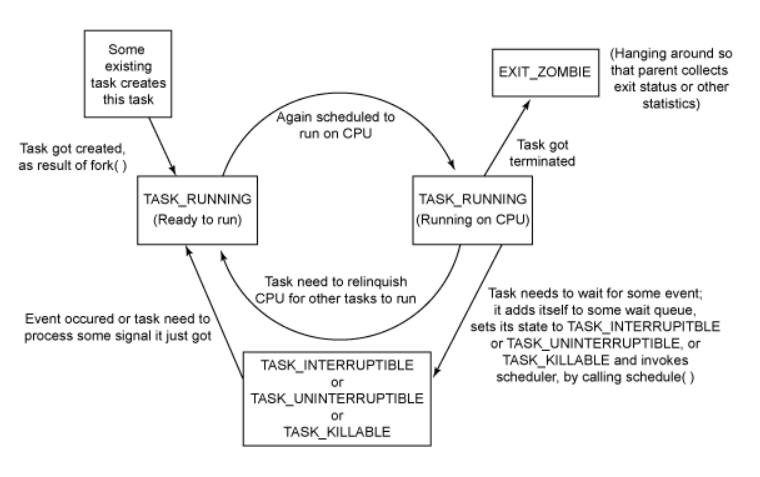
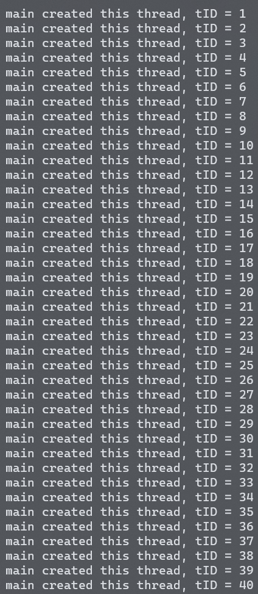
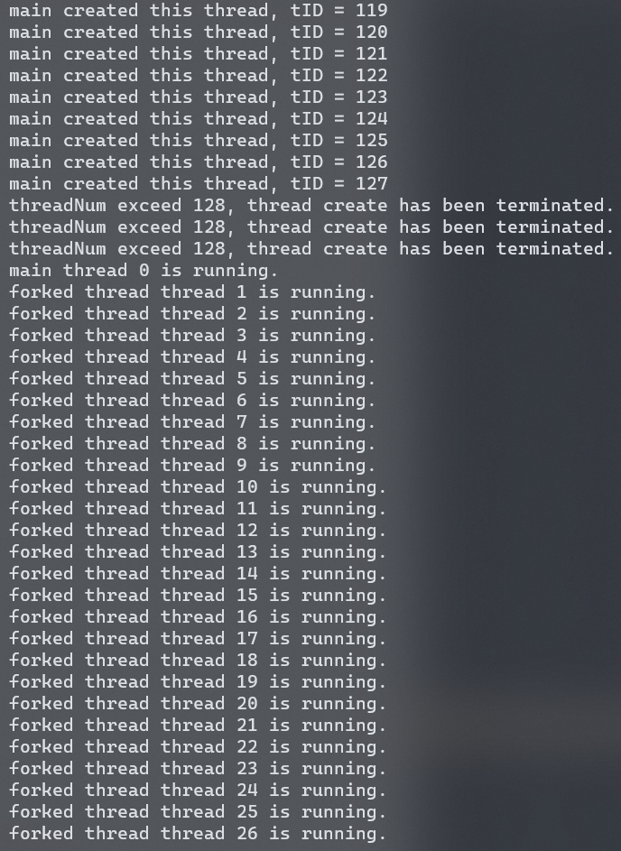
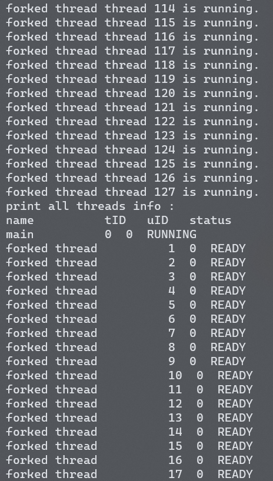
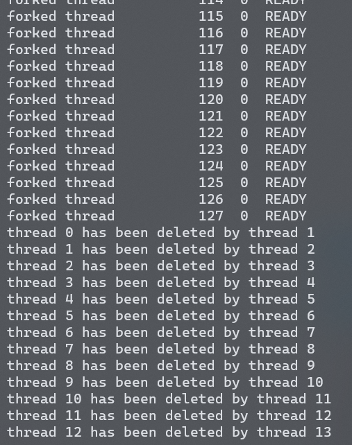
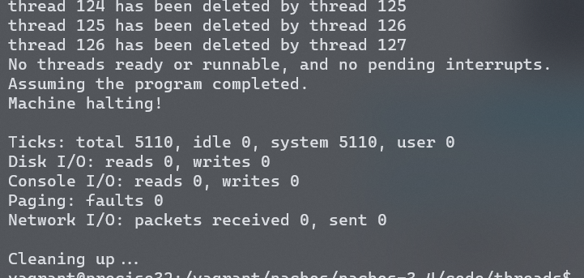
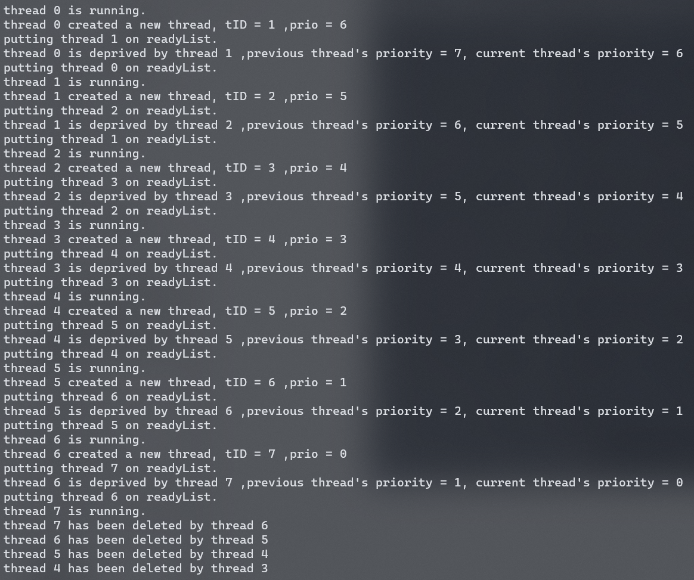

# LAB1 线程机制和线程调度实现

## 任务完成情况

|               任务               | Y/N  |
| :------------------------------: | :--: |
|          调研Linux的PCB          |  Y   |
|       Exercise1 源代码阅读       |  Y   |
|   Exercise2 扩展线程的数据结构   |  Y   |
|  Exercise3 增加全局线程管理机制  |  Y   |
|       Exercise4 源代码阅读       |  Y   |
| Exercise5 实现优先级抢占调度算法 |  Y   |
|   *Chalenge 实现时间片轮转算法   |  Y   |


## 调研Linux的进程控制块

### 五个互斥状态

|         状态         |                             描述                             |
| :------------------: | :----------------------------------------------------------: |
|     TASK_RUNNING     |      表示进程正在执行，或者已经准备就绪，等待处理机调度      |
|  TASK_INTERRUPTIBLE  | 表示进程因等待某种资源而被挂起（阻塞态），一旦资源就绪，进程就会转化为TASK_RUNNING态 |
| TASK_UNINTERRUPTIBLE | 与TASK_INTERRUPTIBLE状态类似，同样表示进程因等待某种资源而阻塞。二者唯一的区别在于：前者可以通过一些信号或者外部中断来唤醒，而后者只能通过等待的资源就绪被唤醒。这种状态很少被用到，但是不代表它没有用，实际上这种状态很有用，特别是对于驱动刺探相关的硬件过程至关重要。 |
|     TASK_STOPPED     | 进程被停止执行，当进程接收到SIGSTOP、SIGTTIN、SIGTSTP或者SIGTTOU信号之后就会进入该状态 |
|     TASK_TRACED      | 表示进程被debugger等进程监视，进程执行被调试程序所停止，当一个进程被另外的进程所监视，每一个信号都会让进城进入该状态 |

### 两个终止状态

|    状态     |                             描述                             |
| :---------: | :----------------------------------------------------------: |
| EXIT_ZOMBIE | 僵尸进程是当子进程比父进程先结束，而父进程又没有回收子进程，释放子进程占用的资源，此时子进程将成为一个僵尸进程。如果父进退出 ，子进程被init接管，子进程退出后init会回收其占用的相关资源，但如果父进程不退出，子进程所占有的进程ID将不会被释放，如果系统中僵尸进程过多，会占用大量的PID，导致PID不足，这是僵尸进程的危害，应当避免 |
|  EXIT_DEAD  |                    进程正常结束的最终状态                    |

### 进程的转换过程



### 调度策略

|                |                                                              |              |
| :------------: | :----------------------------------------------------------: | :----------: |
|      字段      |                             描述                             | 所在调度器类 |
|  SCHED_NORMAL  | （也叫SCHED_OTHER）用于普通进程，通过CFS调度器实现。SCHED_BATCH用于非交互的处理器消耗型进程。SCHED_IDLE是在系统负载很低时使用 |     CFS      |
|  SCHED_BATCH   | SCHED_NORMAL普通进程策略的分化版本。采用分时策略，根据动态优先级(可用nice()API设置），分配 CPU 运算资源。注意：这类进程比上述两类实时进程优先级低，换言之，在有实时进程存在时，实时进程优先调度。但针对吞吐量优化 |     CFS      |
|   SCHED_IDLE   | 优先级最低，在系统空闲时才跑这类进程(如利用闲散计算机资源跑地外文明搜索，蛋白质结构分析等任务，是此调度策略的适用者） |     CFS      |
|   SCHED_FIFO   | 先入先出调度算法（实时调度策略），相同优先级的任务先到先服务，高优先级的任务可以抢占低优先级的任务 |      RT      |
|    SCHED_RR    | 轮流调度算法（实时调度策略），后者提供 Roound-Robin 语义，采用时间片，相同优先级的任务当用完时间片会被放到队列尾部，以保证公平性，同样，高优先级的任务可以抢占低优先级的任务。不同要求的实时任务可以根据需要用sched_setscheduler()API 设置策略 |      RT      |
| SCHED_DEADLINE | 新支持的实时进程调度策略，针对突发型计算，且对延迟和完成时间高度敏感的任务适用。基于Earliest Deadline First (EDF) 调度算法 |              |

> [以上内容参考：Linux进程描述符task_struct结构体详解--Linux进程的管理与调度（一）](https://blog.csdn.net/gatieme/article/details/51383272)

### Linux与Nachos的异同

#### Linux中的task_struct

|                PID                 |
| :--------------------------------: |
|    特征信息(name, tID, tgID等)     |
|              进程状态              |
|               优先级               |
|              通信状态              |
|             现场保护区             |
|       资源需求、分配控制信息       |
|            进程实体信息            |
| 其他（工作单位、工作区、文件信息） |

#### Nachos中的PCB实现

|   成员变量   |    描述    |
| :----------: | :--------: |
|     name     |  进程名字  |
|    status    |  进程状态  |
| machineState | 寄存器状态 |
|   stackTop   |    栈顶    |
|    stack     |    栈底    |

#### 异同

Nachos是一个羽量级的Linux（这么说是不严谨的，因为Nachos很多接口和Linux不同，典型例子--Fork())，Nachos很多功能待完善。

## Exercise1 源代码阅读

### main.cc

**从注释可以看出，main()的作用是引导操作系统内核/检查命令行参数/初始化数据结构/调用测试流程（可选）。**

|                方法                 |                             描述                             |
| :---------------------------------: | :----------------------------------------------------------: |
| DEBUG(char flag, char *format, ...) | 如果启用了该标志（flag），则打印一条调试消息。像printf一样，只是在前面多了一个额外的参数 |
|  Initialize(int argc, char **argv)  | 初始化Nachos全局数据结构。解释命令行参数，以确定用于初始化的标志。“ argc”是命令行参数的数量（包括名称）；“ argv”是一个字符串数组，每个命令行参数占argv中的一个位置 |
|            ThreadTest()             |            调用某个测试流程，可以在case中自定义。            |

### ThreadTest.cc

|        变量/方法        |                             描述                             |
| :---------------------: | :----------------------------------------------------------: |
|         testnum         | 测试编号，可以在命令行中输入`./nachos -q testnum`，以执行对应的测试流程 |
| SimpleThread(int which) | 循环5次，每次迭代都会让出CPU给另外一个就绪进程，which是用来标识线程的简单标志，可用于调试。 |
|      ThreadTest1()      | 通过派生一个线程调用SimpleThread，然后自己调用SimpleThread，在两个线程交替执行 |
|      ThreadTest()       |                根据testnum调用对应的测试流程                 |

### thread.h/thread.cc

|        宏        |                             描述                             |
| :--------------: | :----------------------------------------------------------: |
| MachineStateSize | 上下文切换时需要保存的CPU寄存器状态，SPARC和MIPS仅需要10个，而Snake需要18个，为了能够在每个系统上执行，取值18。 |
|    StackSize     | 线程执行的私有栈空间大小，大小为4096个字(in words, not Bytes）。 |
|   ThreadStatus   | 枚举了线程的状态：JUST_CREATED(创建）,  RUNNING(执行),  READY(就绪），BLOCKED(阻塞)。 |
| STACK_FENCEPOST  |   将其放在执行堆栈的顶部，以检测堆栈溢出，值为`0xdeadbeef`   |

|                      成员变量/方法                      |                             描述                             |
| :-----------------------------------------------------: | :----------------------------------------------------------: |
|                        stackTop                         |                      当前线程的栈顶指针                      |
|                      machineState                       |        栈顶指针所需要的所有寄存器，全部保存在该数组中        |
|             Thread::Thread(char *debugName)             | 初始化线程控制块，以便我们可以调用Thread::Fork。"threadName"是任意字符串，可用于调试。 |
|                    Thread::~Thread()                    | 取消分配线程。 注意：当前线程**不能**直接删除自身， 由于它仍在堆栈中运行，因此我们还需要删除它的堆栈。注意：如果这是主线程，则由于未分配堆栈，因此无法删除堆栈-在启动Nachos时会自动获取堆栈。 |
|      Thread::Fork(VoidFunctionPtr func, void *arg)      | 调用(* func)(arg)，允许调用方和被调用方并发执行。**注意**：尽管定义只允许将单个整数参数传递给过程，但是可以通过将多个参数设为结构的字段，并将指针作为“ arg”传递给该结构来传递多个参数。可以按以下步骤实现：1.分配堆栈2.初始化堆栈，以便对SWITCH的调用将使其运行3.将线程放在就绪队列中“ func”是要同时运行的过程。“ arg”是要传递给该过程的单个参数。 |
|                 Thread::CheckOverflow()                 | 检查线程的堆栈，以查看其是否超出了为其分配的空间。注意：Nachos不会捕获所有堆栈溢出条件。 换句话说，程序可能仍会由于溢出而崩溃。如果得到奇怪的结果（例如没有代码的段错误），那么可能**需要**增加堆栈大小。可以通过不在堆栈上放置大型数据结构来避免堆栈溢出。(不要这样做：void foo（）{int bigArray [10000]; ...} |
|                    Thread::Finish ()                    | 线程完成分叉过程时，由ThreadRoot调用Thread::Finish。**注意**：系统不会立即取消分配线程数据结构或执行堆栈，因为线程仍在堆栈中运行！相反，系统设置“ threadToBeDestroyed”，以便一旦系统在其他线程的上下文中运行，Scheduler::Run()将调用析构函数。 **注意**：该操作为原子操作，禁止中断。 |
|                    Thread::Yield ()                     | 如果有其他就绪线程，让出CPU，再将该线程添加到就绪列表的末尾，以便最终对其进行重新调度。 **注意**：此操作为原子操作，禁止中断。 |
|                    Thread::Sleep ()                     | 放弃CPU，因为当前线程在等待同步变量（信号量，锁定或条件）时被阻塞。最终，某个线程将唤醒该线程，并将其放回到就绪队列中，以便可以对其进行重新调度。 |
| Thread::StackAllocate (VoidFunctionPtr func, void *arg) | 分配并初始化执行堆栈。堆栈使用ThreadRoot的初始堆栈框架初始化，该框架如下： 启用中断 通话(* fun)(carg)调用Thread::Finish |

## Exercise2 扩展线程的数据结构

为了增加用户ID和线程ID，在thread.h中新增`uID`和`tID`两个变量，在`system.h/system.cc`中新增一个大小为128的数组`isAllocatable[128]`,并在`initialize()`方法中对其初始化为全0，**确保**每次nachos执行时该数组会被初始化。最后增加一个变量`threadCount`用于记录线程数，初始化为0。

### 维护tID

在`Thread::Thread()`方法中遍历`isAllocatable`数组，将第一个遇到的未分配的线程ID分配给当前线程，同时threadCount增加1。

在`Thread::~Thread()`方法中将`isAllocatable[this->tID]`重新置为0，然后令`threadCount`减少1。

### 维护uID

与同学讨论之后我们认为nachos没有维护用户ID的条件，因此我将uID设为一个默认值0。如果要维护uID，应该增加在登录时输入用户名和密码的功能，并建立用户名和uID的映射关系。

## Exercise3 增加全局线程管理机制

### 使nachos中最多存在128个线程

在调用`thread::thread()`方法之前先检查`threadCount`的值是否小于128，如果是，代表还能够继续分配线程；如果不是，代表已经达到线程数量的最大值，屏幕打印错误信息。

### 仿照Linux中PS命令，增加一个功能TS(Threads Status)，能够显示当前系统中所有线程的信息和状态

#### 算法思想

题目的要求是在terminal中输入`./nacos -TS`能够打印出线程的信息，为了实现这一功能，应该在shell中增加一个"-TS"的判断。如果用户输入了`./nacos -TS`那么调用TS()方法。但是鉴于现在的能力不足，暂时先用一个TS方法代替，等以后实现了shell之后再来实现这个功能。

#### 定义Thread* threadPtr[128]

在`system.h/system.cc`中新增一个大小为128的类型为Thread*的数组threadPtr，在`initialize()`中初始化为NULL。其作用是建立线程指针和tID之间的映射关系(map)。维护方法和isAllocatable类似，在`Thread::Thread()`方法中，每分配一个tID就让`threadPtr[tID] = this`。在`Thread::~Thread()`方法中令`threadPtr[tID] = NULL`。

#### 定义TS()方法

在`ThreadTest.cc`中定义`TS()`方法，遍历`isAllocatable`数组，每当遇到非零的元素时，通过`threadPtr`找到其对应的线程指针，屏幕打印其对应的`uID/tID/name/status`。

### 成果演示

我在threadTest.cc中new了130个线程，然后让它们交替执行两次，最后调用TS方法查看线程的信息，在terminal中输入`./nachos -q 2`后，执行结果如下：












## Exercise4 源代码阅读

### scheduler.h/scheduler.cc

|                成员方法                |                             描述                             |
| :------------------------------------: | :----------------------------------------------------------: |
|         Scheduler::Scheduler()         |                        初始化就绪队列                        |
|        Scheduler::~Scheduler()         |                         释放就绪队列                         |
| Scheduler::ReadyToRun (Thread *thread) |                    将线程加入就绪队列队尾                    |
|      Scheduler::FindNextToRun ()       |          返回就绪队列队首线程，若队列为空，返回NULL          |
|  Scheduler::Run (Thread *nextThread)   | 将CPU分配给nextThread。保存旧线程的状态，并加载新线程的状态，通过调用机器依赖上下文切换例程SWITCH。注意：threadToBeDestroyed是正在等待释放的线程，因为它们不能自己释放自己，所以必须通过除自己之外的线程来释放。 |
|           Scheduler::Print()           |                    打印就绪队列，用于调试                    |

### timer.h/timer.cc

|        成员变量/方法         |                             描述                             |
| :--------------------------: | :----------------------------------------------------------: |
|          randomize           |                  设置是否需要使用随机时间片                  |
|           handler            |                      计时器中断处理程序                      |
|             arg              |                   中断处理函数所需要的参数                   |
|        Timer::Timer()        | 初始化一个Timer。包括时间中断处理函数及其参数，以及一个可选的随机时间片标记 |
|    Timer::TimerExpired()     |           安排下一次中断的时间，并调用中断处理函数           |
| Timer::TimeOfNextInterrupt() |                        返回时间片大小                        |

在 Timer 的初始化函数中，借用 TimerHandler 成员函数而不直接用初始 化函数中的 timerHandler 参数作为中断处理函数的原因：如果直接使用 timerHandler 作为时钟中断处理函数，一旦中断时刻到来，立即进行中断处理，处理结束后来不及将下一个时钟中断插入到等待处理中断队列。 TimerHandler 内部函数正是处理这个问题。当时钟中断时刻到来时，调用 TimerHandler 函数， 其调用 TimerExpired 方法，该方法将新的时钟中断插入到等待处理中断队列中，然后再调用 真正的时钟中断处理函数。这样 Nachos 就可以定时的收到时钟中断。 

那么为什么不将TimerExpired方法作为时钟中断在Timer的初始化函数中调用呢？这是由于 C++语言不能直接引用一个类成员方法的指针，所以借用 TimerHandler 内部函数。这也是 TimerExpired 必须设计成 public 的方法的原因，因为它要被 TimerHandler 调用。 

> 参考资料：《Nachos中文手册》

在nachos中已经实现了一个模拟计时器Timer，它的作用为：每隔一段时间会产生一次时间中断。需要注释掉system.cc里面的`if(ramdomyeild)`来初始化一个`Timer`，`interrupt.cc::scheduler()`方法表明系统会每隔一个时间片来安排一次时间中断，然后调用时间中断处理函数。	 具体的实现机理：系统初始化一个`Timer`，调用`Interrupt::Schedule`来创建一个名为`toOccur`的延迟中断对象，并将其插入中断队列中，表示在既定的延迟时间之后，会产生中断，并调用中断处理函数。在调用了中断处理函数之后，会将 `yieldOnReturn`标记设为true，表在中断处理函数结束之后会在OneTick()方法中执行进程切换。

### switch.s


> 图源：https://blog.csdn.net/ShiningStarPxx/article/details/7456840

SWITCH函数 Nachos 中系统线程的切换是借助宿主机的正文切换。SWITCH 函数就是完成线程切换的功 能。SWITCH 的语法是这样的：  void SWITCH (Thread *t1, Thread *t2); 其中 t1 是原运行线程指针，t2 是需要切换到的线程指针。线程切换的三步曲是： 保存原线程上下文->恢复新线程的上下文->在新线程的栈空间继续运行。

> 参考资料：《Nachos中文教程》

## Exercise5 实现优先级抢占调度算法

### 算法思想

题目要求实现优先级抢占算法，顾名思义，当线程被创建时，应该与currentThread比较，如果优先级高于currentThread，应该剥夺，否则，按照优先级插入readyList。这些修改都应该写在Scheduler::ReadyToRun方法中。

### 新增变量/语句

|                 位置                  |                        新增变量/语句                         |                             描述                             |
| :-----------------------------------: | :----------------------------------------------------------: | :----------------------------------------------------------: |
|               thread.h                |                             prio                             |              线程优先级（值越小代表优先级越高）              |
| Scheduler::ReadyToRun(Thread *thread) | readyList->SortedInsert((void*) thread, thread->getPrio());  |                 先把thread按照优先级插入队列                 |
| Scheduler::ReadyToRun(Thread *thread) | if (thread->getPrio() < currentThread->getPrio())   currentThread->Yield(); | 如果该线程的优先级高于正在运行的线程，直接抢占，否则什么也不做 |

### 成果演示

我修改了`SimpleThread`的内容，将其改为如果`currentThread`的`priority>0`, 那么就会`fork`一个比它`priority`小1的线程，将main线程的优先级初始化为7，预期结果：`main`会`fork`一个优先级为6的线程，然后被该线程剥夺；然后该线程会`fork`一个优先级为5的线程，然后被这个优先级为5的线程剥夺，直到`fork`出一个优先级为0的线程。在`terminal`中输入`./nachos -q 3`可以查看结果。



## *Chalenge 实现时间片轮转算法

### 算法思想

在Thread类里新增timeSlice时间片成员变量，设为缺省值5，表示我们实现的是固定时间片的时间片轮转算法（如果要实现可变时间片，那么修改Thread的构造函数即可）。并且增设totalRunningTime成员变量，用来表示当前进程的总执行时间，设为缺省值10，表示每个进程都是10个单位时间执行完成（也可以自定义，这样更贴合实际中作业长短不一的情况）（虽然在实际中某进程的执行时间不可预计，但是在我们的测试中可以将某进程的总执行时间设为缺省值，因为我们的任务是检查时间片轮转是否生效）。

可以修改`TimerTicks`宏来自定义时间片。将`TimerTicks`的大小设为1，这样就能实现每个单位时间都会产生中断，并且在中断处理函数中会让当前进程的时间片和总的运行时间都减少1，并且check一下当前进程的时间片是否已经用完，如果用完，那么就进行线程切换。每次中断之后，系统都会调用OneTick方法来让系统时间增加10，这是Nachos作者为了方便起见定义每次中断处理都会花费10的时间（若为用户指令，则为1）。

### 新增语句

|                位置                |                        新增变量/语句                         |                          描述                          |
| :--------------------------------: | :----------------------------------------------------------: | :----------------------------------------------------: |
|              Thread.h              |                          timeSlice                           |                       线程时间片                       |
|              Thread.h              |                       totalRunningTime                       |                    线程的总运行时间                    |
| system.cc::TimerInterruptHandler() | currentThread->totalRunningTime--;currentThread->timeSlice--; |           当前线程的运行时间和时间片均自减1            |
| system.cc::TimerInterruptHandler() | if (!currentThread->timeSlice){currentThread->timeSlice = 5;interrupt->YieldOnReturn();} | 若当前线程时间片用完，重新赋予时间片，并且进行线程切换 |

### 成果演示

我在测试函数中new了一个线程，加上main()线程，总共两个。他们的总运行时间都为10，时间片都是5。系统每隔一个单位时间会产生一次时钟中断来check当前线程的时间片是否用完。中断处理会花费10的单位时间，相当于每隔10的单位时间会check一次，每check一次，当前进程的运行时间就会+1，直到达到它的总运行时间为止，预期结果：每隔5的单位时间会发生一次线程切换（算上中断处理的时间是50），并且在两个线程的运行时间达到10时结束。在terminal中输入`./nachos -q 4`可查看结果：


## 困难&解决

首先，必须声明的一点是，我的OS学习之路是坎坷且崎岖的。一个月前，为了搭建nachos的实验环境，且怀揣着对新鲜事物的好奇感，我花了三天时间特意学习了Docker，理解了docker的运行机制并成功地将Nachos封装成一个image，永久地保存在了DokcerHub上。这么做的意义在于：以后的同学都可以pull到本地，并且整个过程不超过5分钟，这将大大缩短同学们配置环境的时间。

这次小小的成功的确给我带来的很大的成就感。可是好景不长，我发现在docker中编辑代码非常困难，因为只能用原生的vim，而我已经用习惯了vscode，并且确信它的效率不比vim差甚至可以说高于vim，所以我开始寻找一种可以在windows平台下编辑代码，然后在docker中编译的方法。

功夫不负有心人，我发现一款叫做remote-containers的插件，它可以通过ssh连接远程的container，所有的开发都可以在windows平台下进行。“这简直就是为我量身定做的，感谢微软的开发者们！致敬！”安静的图书馆中一颗激动的心正汹涌澎湃着，“今天拿下！”

于是我花了大量时间来搭建remote-containers。可是当我连接nachos的时候，一直报错“容器架构不支持！”然后我去查阅了官方文档，发现容器的Ubuntu版本至少需要16.04，而我的版本是14.04.“版本低了啊，那用一个16.04的重新配置一次nachos不就行了吗？”经历小小挫败的我并没有灰心，而是立刻投身DockerHub，下载i386/ubuntu 16.04(32bit)。“下载成功！”

- `sudo apt-get install gcc-5 g++-5` 

- "can not locate gcc-5!"

为了解决这个问题，我把google上能搜到的安装低版本gcc的方法试了个遍，无果。这时候一整天已经过去了。”我一整天啥也没干，真是个废物。“

”我讨厌浪费时间，环境配置的工作没有意义，和我想学的东西一点关系都没有，但是我却要花这么多时间，它不配！“午夜，看着室友花一整天刷了很多力扣脸上洋溢着的成就感，愤怒的火在我心中越烧越烈。

次日，经历了魔鬼配置环境的一天之后，我决定换个方法，”试试vagrant“。于是我按照课程网上的视屏教程，一步一步地做：”安装virtualBox， 安装vagrant，安装git， 添加ssh环境变量...”“哦视频上的软件版本有些旧了，用新版的可行吗？试试吧。”

- `vagrant up`
- "vagrant up timeout."

”看来新版本的不支持啊？那就用老版本吧。“

- `vagrant up`
- "vagrant up timeout."

”为什么呢？找同学问问吧。“于是我去找成功配置了vagrant的同学讨教经验，发现一个让人心如死灰的事实：我们两的环境一摸一样，但是vagrant能在他的电脑上运行，我的却不行。”生活就是这样，你永远不知道明天和意外哪个会先来。“

至于后来，我尝试了虚拟机的共享文件夹，但是在make的时候会报错"create symbolic link failed， code/thread/switch.c not found",我怀疑是32位和64位系统文件不兼容的问题。

”什么？你要问我后来怎么样了？“

首先要说一个令人开心的事实，我在旧电脑上成功配置了vagrant，并且用vscode无论是编辑还是查看代码都爽的飞起。但是令人遗憾的事情似乎更多。此时的我，已经完完整整地经历了为期三天的被环境配置折磨的过程。我浪费了生命中三天的时间，谁来赔我？

最后，如果要我对这个课程提出一个建议的话，那一定是”请提供实验环境！“

​																																							                                                                 以上

## 收获及感想

上面的负能量可能比较多，现在开始抒发正能量。

通过本次lab我发现实验没有那么难，最困难的事情应该是从零开始写一个OS。而我们的实验都是建立在别人的框架之上的，我们要做的就是：阅读框架->理解框架->添砖加瓦。

这里要分享一下我读源代码的方法：先看注释，了解某个方法是干什么的。然后再看这个方法的实现，理解之后，默写一遍。对，很多模块除开注释也就几十行，如果你真的理解了，默写并不困难。如果你都做到了，那么就可以自信地说自己已经理解源代码了。

理解了源代码之后，要解决每个exercise基本可以说是信手拈来。

## BUGs

1.通过阅读scheduler.cc中的Run方法我发现了一个nachos的BUG：SWITCH和delete threadToBeDestroyed的顺序反了，这样会导致finish方法调用之后，线程并不会被及时地析构，而系统会进入下一个就绪线程继续运行，原来的这个线程就被永远地阻塞！

猜想：要解决这个bug， 需要将SWITCH和delete的顺序颠倒，这需要我们提前复制一份threadToBeDestroyed的栈空间，以便delete之后可以用它来给SWITCH使用。

2.Nachos的模拟时间在测试函数无限循环时不会增加，比如说，当我写下如下语句时,系统时间会停滞.解决办法：在while中添加一句：interrupt->OneTick()。但是这么做是不妥的，因为OneTick方法是内部硬件的模拟方法，不该直接调用，它的属性应为`private`，之所以为`public`是因为它被硬件模拟代码直接调用。也就是说OneTick()方法出现在此处是不对的，但是我暂时想不到更好的方法，如果有人能解决这个问题，欢迎交流。

```cpp
//time-slicing algorithm,in threadTest.cc
void mySimlpe2(int dummy)
{
    while (stats->totalTicks < 3000);//当系统时间小于3000时无限循环，在测试中使用无限循环来模拟实际中作业的执行
}
void timeSlicingTest()
{
    Thread *t = new Thread("forked", 1);
    t->Fork(mySimlpe2, 1);
    mySimlpe2(1);
}
```


## 参考文献

[Linux进程描述符task_struct结构体详解--Linux进程的管理与调度（一）](https://blog.csdn.net/gatieme/article/details/51383272)

[汇编语言入门教程](https://www.ruanyifeng.com/blog/2018/01/assembly-language-primer.html)

《Nachos中文教程》

## 致谢

感谢罗哥在我最沮丧的时候陪伴我安装vagrant，虽然没有成功。

感谢陈向群老师多次帮助，感恩。