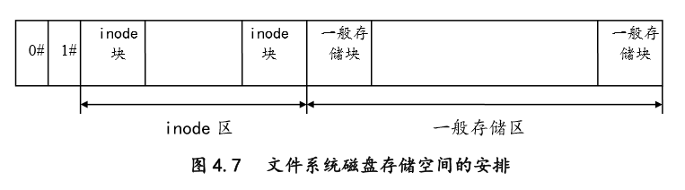
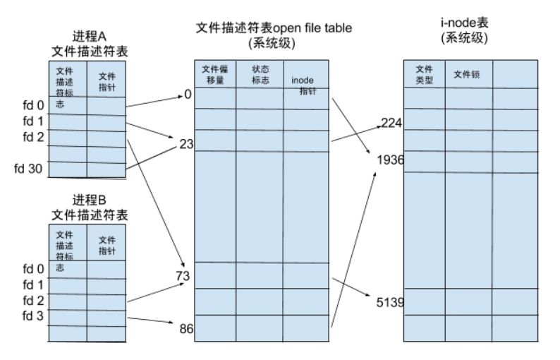

# Lab4 文件系统

## 说明

本次*lab*中的测试结果均使用代码块保存，这是因为测试结果比较长，截图不好看。本人郑重承诺所有结果均无篡改情况，并且本人愿意承担篡改结果的一切后果。每个测试之前都给出了方法，欢迎验证。[我的*github*](https://github.com/Bug-terminator/nachos)

*Tips*：在使用*vscode*编辑时，可以先把*main*.*cc*中关于*fileSystem*的*define*全部注释掉，这样可以方便代码补全。举个例子：

```cpp
//#ifdef FILESYS //暂时注释
    synchDisk = new SynchDisk("DISK");
//#endif
```

后期再通过*ctrl+shift+f*查找关键字“*暂时*”把对应的代码还原。

> 【实习建议】
>
> 1. 数据结构的修改和维护
>
> - 文件管理的升级基于对原有*Nachos*数据结构的修改。增加文件的描述信息需对文件头结构进行简单修改。多级目录中可创建目录也可创建文件，应根据实际的文件类型初始化文件头信息。
>
> 2. 实现多级目录应当注意
>
> - 目录文件的含义。每个目录对应一个文件，通过此文件可了解其子目录及父目录的信息。
>
> - *Nachos*的目录文件大小是预先定义的，但实际上，目录文件的大小应根据内容确定，且能改变。
>
> - 实现多级目录后，添加、删除目录项要根据具体的路径，对树的遍历要有深刻的理解。
>
> 3. 为了实现文件长度无限，可以采取混合索引的分配方式。

## 任务完成情况

|  Exercises   | Y/N  |
| :----------: | :--: |
| *Exercise1*  | *Y*  |
| *Exercise2*  | *Y*  |
| *Exercise3*  | *Y*  |
| *Exercise4*  | *Y*  |
| *Exercise5*  | *Y*  |
| *Exercise6*  | *Y*  |
| *Exercise7*  | *Y*  |
| *Challenge1* | *Y*  |
| *Challenge2* | *Y*  |

## 一、文件系统的基本操作

### *Exercise1* 源代码阅读

> 阅读*Nachos*源代码中与文件系统相关的代码，理解*Nachos*文件系统的工作原理。
>
> *code/filesys/filesys.h*和*code/filesys/filesys.cc*
>
> *code/filesys/filehdr.h*和*code/filesys/filehdr.cc*
>
> *code/filesys/directory.h*和*code/filesys/directory.cc*
>
> *code /filesys/*OpenFile*.h*和*code /filesys/*OpenFile*.cc*
>
> *code/userprog/bitmap.h*和*code/userprog/bitmap.cc*

> ```
> *Nachos* File System
> 
> +-----------------------------------+
> |             FileSystem            |
> +-----------------------------------+
> |              OpenFile             |	 ->memory(*i-node* index)
> +------------+----------+-----------+
> | File Header| Directory|  Bitmap   |    ->disk(*i-node*)                 
> +-----------------------------------+
> |             SynchDisk             |
> +-----------------------------------+
> |                Disk               |
> +-----------------------------------+
> ```

#### *bitmap.cc bitmap.h*

> 在 *Nachos* 的文件系统中，是通过位图来管理空闲块的。*Nachos* 的物理磁盘是以扇区为访问单位的，将扇区从 *0* 开始编号。所谓位图管理，就是将这些编号填入一张表，表中为 *0* 的地 方说明该扇区没有被占用，而非 *0* 位置说明该扇区已被占用。这部分内容是用 *BitMap* 类实现的。

```cpp
class BitMap
{
public:
  BitMap(int nitems); // 初始化一个位图
  ~BitMap();          // 析构位图

  void Mark(int which);  // 将第n位设为1
  void Clear(int which); // 将第n位设为0
  bool Test(int which);  // 检查第n位是否为1
  int Find();            // 找第一个值为0的位，并置为1，如果找不到返回-1
  int NumClear();        // 返回值为0的位数
  void Print();          // 打印位图信息
  void FetchFrom(OpenFile *file); // 从Nachos磁盘读取数据到宿主主机内存
  void WriteBack(OpenFile *file); // 从宿主主机内存写回Nachos磁盘

private:
  int numBits;       // 位图的位数
  int numWords;      // 位图的字节数
  unsigned int *map; // bit以unsigned int的数据类型存储，这是bitmap的起点指针
};
```

#### *filehdr.cc filehdr.h*

> 文件头实际上就是 *UNIX* 文件系统中所说的 *i-node* 结构，它给出一个文件除了文件名之外的所有属性，包括文件长度、地址索引表等等（文件名属性在目录中给出）。所谓索引表，就是文件的逻辑地址和实际的物理地址的对应关系。*Nachos* 的文件头可以存放在磁盘上，也可以存放在宿主机内存中。在磁盘上存放时一个文件头占用一个独立的扇区。*Nachos* 文件 头的索引表只有直接索引。 
>
> 文件头的定义和实现如下所示，由于目前 *Nachos*只支持直接索引，而且文件长度一旦固定， 就不能变动。所以文件头的实现比较简单，这里不再赘述。 

```cpp
class FileHeader
{ //*i-node*
public:
  bool Allocate(BitMap *bitMap, int fileSize); // 通过文件大小初始化*i-node*（新）
  void DeAllocate(BitMap *bitMap);             // 将一个文件所占用的数据空间释放（没有释放*i-node*的空间）
  void FetchFrom(int sectorNumber);            // 从磁盘中取出*i-node*（旧）
  void WriteBack(int sectorNumber);            // 将*i-node*写入磁盘
  int ByteToSector(int offset);                // 实现文件逻辑地址到物理地址的转换
  int FileLength();                            // 返回文件长度
  void Print();                                // 打印文件头信息（调试用）
private:
  int numBytes;               // 文件字节数
  int numSectors;             // 文件占的扇区数
  int dataSectors[NumDirect]; // 文件索引表
};
```

按照习惯，我将*Nachos*的*FileHeader*称为*i-node*，下同。

#### *OpenFile.cc OpenFile.h*

> 该模块定义了一个打开文件控制结构。当用户打开了一个文件时，系统即为其产生一个打开文件控制结构，以后用户对该文件的访问都可以通过该结构。打开文件控制结构中的对文件操作的方法同 *UNIX* 操作系统中的系统调用。 

```cpp
class OpenFile {
  public:
    OpenFile(int sector);		// 打开文件初始化方法，sector为文件头*i-node*的扇区号
    ~OpenFile();			    // 关闭文件
    void Seek(int position); 		                     // 移动文件位置指针（从头文件开始）
    int Read(char *into, int numBytes);                  // 从文件中读入into缓冲
    int Write(char *from, int numBytes);                 //从from缓冲写入文件
    int ReadAt(char *into, int numBytes, int position);  //从文件position开始读
    int WriteAt(char *from, int numBytes, int position); //写入文件position开始的位置
    int Length(); 			                             // 返回文件长度
  private:
    FileHeader *hdr;			// 该文件对应的文件头*i-node*（建立关系）
    int seekPosition;			// 当前文件位置指针
};
```

#### *directory.cc directory.h*

> 目录在文件系统中是一个很重要的部分，它实际上是一张表，将字符形式的文件名与实际文件的文件头相对应。这样用户就能方便地通过文件名来访问文件。 *Nachos* 中的目录结构非常简单，它只有一级目录，也就是只有根目录；而且根目录的大小是固定的，整个文件系统中只能存放有限个文件。这样的实现比较简单，这里只介绍目录的接口： 

```cpp
class Directory
{
public:
  Directory(int size); // 初始化一张空目录，size规定了目录中存放文件个数
  ~Directory();        // 析构目录
  void FetchFrom(OpenFile *file); // 从目录*i-node*中读入目录内容到内存
  void WriteBack(OpenFile *file); // 将该目录内容从内存写回目录*i-node*
  int Find(char *name); // 在目录中找文件名，返回文件的*i-node*的物理位置
  bool Add(char *name, int newSector); // 在目录中添加一个文件
  bool Remove(char *name); // 从目录中移除一个文件
  void List();  // 打印目录信息
  void Print(); // 详细打印目录信息
private:
  int tableSize;         // 目录项数
  DirectoryEntry *table; // 目录项表
  int FindIndex(char *name); // 根据文件名找出该文件在目录中的序号
};

```

#### *filesys.cc filesys.h*

>  读者在增强了线程管理的功能后，可以同时开展文件系统部分功能的增强或实现虚拟内存两部分工作。在 *Nachos* 中，实现了两套文件系统，它们对外接口是完全一样的：一套称作为 *FILESYS_STUB*，它是建立在 *UNIX* 文件系统之上的，而不使用 *Nachos* 的模拟磁盘，它主要用于读者先实现了用户程序和虚拟内存，然后再着手增强文件系统的功能；另一套是 *Nachos* 的文件系统，它是实现在 *Nachos* 的虚拟磁盘上的。当整个系统完成之后，只能使用第二套文件系统的实现。 

```cpp
class FileSystem
{
public:
	FileSystem(bool format);				  // 初始化文件系统
	bool Create(char *name, int initialSize); // 创造文件
	OpenFile *Open(char *name);				  // 打开文件
	bool Remove(char *name);				  // 删除文件
	void List();							  // 打印文件系统中的所有文件
	void Print();							  //详细列出文件和内容
private:
	OpenFile *freeMapFile;	 // 文件系统位图
	OpenFile *directoryFile; // 文件系统根目录
};
```

### *Exercise2* 扩展文件属性

> 增加文件描述信息，如“类型”、“创建时间”、“上次访问时间”、“上次修改时间”、“路径”等等。尝试突破文件名长度的限制。

#### 背景知识：*UNIX* *i-node*

> 1.*UNIX*文件系统中的主要结构 *i-node* ，目录项中记录的是文件名和文件相对应的 *i-node* 在整个 *i-node* 区中的索引号，文件 *i-node* 结构中除了存放文件的属性外，最主要的是文件的索引表。
>
> 2.磁盘存储空间的安排 在 *UNIX* 文件系统中，磁盘块的作用分成两类：一类存放文件的 *i-node*，这一类磁盘块组织 在一起，形成 *i-node* 区；另一类存放文件内容本身，该类的集合形成存储数据区，如图 *4.7*。 图中， *0#*块用来存放系统的自举程序； *1#*块为管理块，管理本文件系统中资源的申请和回收。 主要内容有：
>
> 
>
> 3. 每个*Nachos* 文件的 *i-node* 占用一个单独的扇区，分散在物理磁盘的任何地方，同一般存储扇区用同样的方式进行申请和回收。
>
>    ```
>    *Nachos* Disk Allocation Structure
>    
>    +----+----+---------------------+
>    | 0# | 1# | Normal Storage Area |
>    +----+----+---------------------+
>      |     |
>      |    1#: Root directory's *i-node*
>      |
>     0#: System bitmap file's *i-node*
>    ```
>
> 4. *Nachos* 则只有一级目录，也就是只有根目录，所有的文件都在根目录下。而且根目录中可以存放的文件数是有限的。*Nachos* 文件系统的根目录同样也是通过文件方式存放的，它的 *i-node* 占据了 *1* 号扇区。
>
> 5. *Nachos* 同一般的 *UNIX* 一样，采用索引表进行物理地址和逻辑地址之间的转换，索引表存放在文件的 *i-node* 中。但是目前 *Nachos* 采用的索引都是直接索引，所以 *Nachos* 的最大文件长度不能大于*4K*。

#### 新增变量

*Nachos*的*file* *header*等价于*UNIX*中的*i-node*，因此我将题述的几个变量加在*code*/*filesys*/*filehdr*.*h*的*FileHeader*类中，并调用*c*语言库*time.h*来获取时间。

```cpp
class FileHeader
{
  ...
private:
  //lab4 exercise2
  char *lastVisitedTime;
  char *lastModifiedTime;
  char *CreateTime;
  char *path;
  FileType fileType;
  int inodeSector;//OpenFile析构时需要保存信息
};
//此外还有这几个成员变量的Getter()&Setter(),这里不再赘述。
```

新增宏：

```cpp
//----------------------------------------------------------------------
//Lab4 exercise2 新增成员变量
//----------------------------------------------------------------------
#define VAR_NUM  8                                                     // *i-node*中共8个变量
#define NumDirect ((SectorSize - VAR_NUM * sizeof(int)) / sizeof(int)) // *i-node*中索引表大小,值为24           
#define MaxFileSize (NumDirect * SectorSize)                           //文件最大长度 24 * 128 = 3072B
```

#### 维护成员变量						

*Nachos*文件通过code/filesys/filesys.cc中的*Create*函数创建，创建文件会调用*FileHeader*::*Allocate*()函数初始化一个*i-node*，应该在此函数内部增加对*CreateTime*的维护。每次通过*OpenFile*访问文件，在读时需要对*lastVisitedTime*进行更新，在写时需要对*lastModifiedTime*进行更新，并且需要在*OpenFile*的析构函数中加入将*hdr*写回磁盘的语句。

```cpp
int OpenFil*::ReadAt(char *into, int numBytes, int position)
{
    //lab4 exercise2
    hdr->SetlastVisitedTime();
    return numBytes;
}

int OpenFile::WriteAt(char *from, int numBytes, int position)
{
    //lab4 exercise2
    hdr->SetlastModifiedTime();
    hdr->SetlastVisitedTime();
    // synchDisk->rwLock[hdr->GetInodeSector()]->WriterRelease();
    return numBytes;
}

OpenFile::~OpenFile()
{
    //lab4 exercise2
    hdr->WriteBack(hdr->GetInodeSector());
    delete hdr;
}
```

以上的实现假设对*i-node*的修改不算作对文件本身的修改。

更多细节请查看*code/filesys/OpenFile.cc*和*code/filesys/filehdr.cc*。

#### 突破文件名长度的限制

将*char[]*改为*char* \* ，并修改*ADD()*和*FindIndex()*函数中的*strncmp()*和*strncpy()*函数即可。

#### 反思

> [*Linux dentry-github*](https://github.com/torvalds/*Linux*/blob/master/include/*Linux*/dcache.h)
>
> [深入 char * ,char ** ,char a[] ,char *a[] 内核-CSDN](https://blog.csdn.net/daiyutage/article/details/8604720)

*Linux*中文件名的存储方式为*char[]*,这引起了我的反思。为什么放着空间更小，表达长度更多的的*char* \*不用，要选择固定长度的，占空间更大的*char[]*？因为*char*表示的内存在主机关机之后会被回收，下一次开机，用同样的内存地址去寻找必然导致出错。而且在*exercise3*中，使用*char*\*的变量都出现了乱码，*difrectory*中*print*时会报*segmentation* *fault*。

```cpp
*Create*d: KSt10moneypunctIcLb1EE13negative_signEv
Modified: KSt10moneypunctIcLb1EE13negative_signEv
Visited: KSt10moneypunctIcLb1EE13negative_signEv*FileHeader* 
```

#### 重新扩展文件属性

在一番思考之后，我决定将将时间变量用*time_t*来存储，然后调用*timeToString()*函数进行转换，这样占的存储空间依然很小：*sizeof(time_t) = 4*。

然而，文件名要用*char[]*来存储，原因就是*char*\*指向的内存有被覆盖的风险。文件名最大长度可以通过修改*FileNameMaxLen*宏，考虑到*Nachos*磁盘空间实在有些小，我暂时将其修改为*20*，如果以后有需要，再扩展。

另外*path*是一个多余的变量，如果要实现*path*f的话，也要用*char[]*数组来存储，这样会占大量的空间。可以参考*Linux*中*pwd*的实现：在目录中加入“./”和“../“，利用后序遍历的思想(自底向上)，递归地从上往下打印出当前路径。

```cpp
//lab4 exercise2
private:
  time_t lastVisitedTime;
  time_t lastModifiedTime;
  time_t CreateTime;
  char *path;//之后可能会删除
  FileType fileType;
  int inodeSector; //OpenFile析构时需要保存信息
  char *TimeToString(time_t t);

// time_t到可读的时间串转换
char FileHeader::TimeToString(time_t t)
{
    struct tm *timeinfo;
    timeinfo = localtime(&t);
    return asctime(timeinfo);
}
```

#### 扩展文件属性测试

```cpp
vagrant@precise32:/vagrant/Nachos/Nachos-3.4/code/filesys$ ./Nachos -f -D
Bit map file header:
File type: NORM
Created: Sat Nov 28 08:09:49 2020
Modified: Sat Nov 28 08:09:49 2020
Visited: Sat Nov 28 08:09:49 2020
FileHeader contents.  File size: 128.  File blocks:
2
File contents:
\f\0\0\0\0\0\0\0\0\0\0\0\0\0\0\0\0\0\0\0\0\0\0\0\0\0\0\0\0\0\0\0\0\0\0\0\0\0\0\0\0\0\0\0\0\0\0\0\0\0\0\0\0\0\0\0\0\0\0\0\0\0\0\0\0\0\0\0\0\0\0\0\0\0\0\0\0\0\0\0\0\0\0\0\0\0\0\0\0\0\0\0\0\0\0\0\0\0\0\0\0\0\0\0\0\0\0\0\0\0\0\0\0\0\0\0\0\0\0\0\0\0\0\0\0\0\0\0
Directory file header:
File type: DIR
Created: Sat Nov 28 08:09:49 2020
Modified: Sat Nov 28 08:09:49 2020
Visited: Sat Nov 28 08:09:49 2020
FileHeader contents.  File size: 120.  File blocks:
3
File contents:
\0\0\0\0\0\0\0\0\0\0\0\0\0\0\0\0\0\0\0\0\0\0\0\0\0\0\0\0\0\0\0\0\0\0\0\0\0\0\0\0\0\0\0\0\0\0\0\0\0\0\0\0\0\0\0\0\0\0\0\0\0\0\0\0\0\0\0\0\0\0\0\0\0\0\0\0\0\0\0\0\0\0\0\0\0\0\0\0\0\0\0\0\0\0\0\0\0\0\0\0\0\0\0\0\0\0\0\0\0\0\0\0\0\0\0\0\0\0\0\0
Bitmap set:
0, 1, 2, 3,
Directory contents:
```

测试显示三个时间是相同的，是因为测试使用的是格式化磁盘，没有进行读写。在*exercise3*的大文件测试中，*LargeFile*的三个时间有时间差，可以证明我们的实现是正确的。

```cpp
Name: largeFile, Sector: 6
File type: NORM
Created: Thu Dec  3 01:39:34 2020
Modified: Thu Dec  3 01:39:44 2020
Visited: Thu Dec  3 01:39:44 2020
```

#### 突破文件名长度测试

```cpp
vagrant@precise32:/vagrant/Nachos/Nachos-3.4/code/filesys$ ./Nachos -f -cp test/small this_is_a_fileName -D
Bit map file header:
File type: NORM
Created: Sat Nov 28 09:44:10 2020
Modified: Sat Nov 28 09:44:10 2020
Visited: Sat Nov 28 09:44:10 2020
FileHeader contents.  File size: 128.  File blocks:
2
File contents:
\0\0\0\0\0\0\0\0\0\0\0\0\0\0\0\0\0\0\0\0\0\0\0\0\0\0\0\0\0\0\0\0\0\0\0\0\0\0\0\0\0\0\0\0\0\0\0\0\0\0\0\0\0\0\0\0\0\0\0\0\0\0\0\0\0\0\0\0\0\0\0\0\0\0\0\0\0\0\0\0\0\0\0\0\0\0\0\0\0\0\0\0\0\0\0\0\0\0\0\0\0\0\0\0\0\0\0\0\0\0\0\0\0\0\0\0\0\0\0\0\0\0\0\0\0\0\0
Directory file header:
File type: DIR
Created: Sat Nov 28 09:44:10 2020
Modified: Sat Nov 28 09:44:10 2020
Visited: Sat Nov 28 09:44:10 2020
FileHeader contents.  File size: 120.  File blocks:
3
File contents:
\1\0\0\0\4\0\0\this_is_a_fileName\0\0\0\0\0\0\0\0\0\0\0\0\0\0\0\0\0\0\0\0\0\0\0\0\0\0\0\0\0\0\0\0\0\0\0\0\0\0\0\0\0\0\0\0\0\0\0\0\0\0\0\0\0\0\0\0\0\0\0\0\0\0\0\0\0\0\0\0\0\0\0\0\0\0\0\0\0\0\0\0\0\0\0\0\0\0\0\0\0\0\0\0\0\0\0\0\0\0\0\0\0\0\0\0\0\0
Bitmap set:
0, 1, 2, 3, 4, 5,
Directory contents:
Name: this_is_a_fileName, Sector: 4
File type: NORM
Created: Sat Nov 28 09:44:10 2020
Modified: Sat Nov 28 09:44:10 2020
Visited: Sat Nov 28 09:44:10 2020
FileHeader contents.  File size: 38.  File blocks:
5
File contents:
This is the spring of our discontent.\a
```

#### 结论

成功添加文件属性，成功突破文件名长度为*10*的限制，成功完成*exercise2*。

### *Exercise3* 扩展文件长度

> 改直接索引为间接索引，以突破文件长度不能超过*4KB*的限制。

#### *Allocate()/DeAllocate()*

每次调用*Filesystem*::*Create()*函数，都会调用*FileHeader::Allocate()*来分配物理空间。

在*exercise2*中增加*6*个成员变量之后，文件的最大长度变为*3072B*，文件索引为*24*项。

*Nachos*的磁盘大小块数为*32\*32 = 1024*块（*code/machine/disk.h*)，直接索引可以存储*1*块物理空间，一级间接索引可以存储*32*块物理块，二级间接索引可以存储*32\*32=1024*块物理块，因此要完整地存储*Nachos*的全部磁盘，只需要一个二级索引即可。然而直接索引获取目标需要一次*I/O*，一级索引需要两次*I/O*，而二级索引需要三次*I/O*,为了避免*I/O*过多引起的时间消耗，应尽量多地分配直接索引和一级索引，最后再用二级索引。因此，我的分配方案为：前*22*项为直接索引，第*23*项为一级索引，第*24*项为二级索引。

新增宏定义如下：

```cpp
#define SECPERIND 32                      //每一个间接索引可以表示的物理块数，sectors per indirect
#define NUMDIRECT 22                      //直接索引表示的最大块数
#define NUMSINGLE (NUMDIRECT + SECPERIND) //一级索引表达的最大块数
#define SINGLEINDEX NUMDIRECT             //一级索引下标
#define DOUBLEINDEX (SINGLEINDEX + 1)     //二级索引下标
```

```cpp
bool FileHeader::Allocate(BitMap *freeMap, int fileSize)
{

    numSectors = divRoundUp(fileSize, SectorSize);
    numBytes = numSectors * SectorSize;
    ASSERT(freeMap->NumClear() >= numSectors);
    int i = 0, ii = 0, iii = 0; //direct/single/double indxing
    //direct indexing
    for (; i < numSectors && i < NUMDIRECT; i++)
        if ((dataSectors[i] = freeMap->Find()) == -1)
            return FALSE;

    //single indexing
    if (numSectors > NUMDIRECT)
    {
        int buffer[SECPERIND] = {0};
        if ((dataSectors[SINGLEINDEX] = freeMap->Find()) == -1)
            return FALSE;
        for (; i < numSectors && i < NUMSINGLE; i++)
            if ((buffer[i - NUMDIRECT] = freeMap->Find()) == -1)
                return FALSE;
        synchDisk->WriteSector(dataSectors[SINGLEINDEX], (char *)buffer);
    }

    //double indexing
    if (numSectors > NUMSINGLE)
    {
        int doubleBuffer[SECPERIND] = {0};
        if ((dataSectors[DOUBLEINDEX] = freeMap->Find()) == -1)
            return FALSE;
        for (; i < numSectors && ii < SECPERIND; ++ii)
        {
            int singleBuffer[SECPERIND] = {0};
            if ((doubleBuffer[ii] = freeMap->Find()) == -1)
                return FALSE;
            for (; i < numSectors && iii < SECPERIND; i++, iii++)
                if ((singleBuffer[iii] = freeMap->Find()) == -1)
                    return FALSE;
            iii %= SECPERIND;
            synchDisk->WriteSector(doubleBuffer[ii], (char *)singleBuffer);
        }
        synchDisk->WriteSector(dataSectors[DOUBLEINDEX], (char *)doubleBuffer);
    }

    DEBUG('f', "===========succesfs allocate %d sectors.=============\n", numSectors);
    //lab4 exercise2
    SetCreateTime();
    SetLastModifiedTime();
    SetLastVisitedTime();
    return TRUE;
}
```

而*DeAllocate*为*Allocate*的逆向操作，这里不再赘述。

#### *ByteToSector()*

每次执行地址转换的函数是*ByteToSector()*，改变了索引方式之后，我们也需要对它进行改变。

```cpp
int FileHeader::ByteToSector(int offset)
{
    int secNum = offset / SectorSize;
    if (secNum < NUMDIRECT) //直接索引
    {
        return dataSectors[secNum];
    }
    else if (secNum < NUMSINGLE) //一级索引
    {
        int buffer[SECPERIND];
        synchDisk->ReadSector(dataSectors[NUMDIRECT], (char *)buffer);
        return buffer[secNum - NUMDIRECT];
    }
    else //二级索引
    {
        int doubleBuffer[SECPERIND], singleBuffer[SECPERIND];
        synchDisk->ReadSector(dataSectors[NUMDIRECT + 1], (char *)doubleBuffer);
        const int index = (secNum - NUMSINGLE) / SECPERIND, offset = (secNum - NUMSINGLE) % SECPERIND;
        synchDisk->ReadSector(doubleBuffer[index], (char *)singleBuffer);
        return singleBuffer[offset];
    }
}
```

关于其他代码的改动(*DeAllocate(), Print(), etc.*)，请查看*code/filesys/filehdr.cc*;

#### 测试

> 这里我引用了*github*一位学长的测试脚本，位于*code\filesys\test\_large_file_test.sh*中，该脚本文件的作用为
>
> 产生一个大文件，复制进*Nachos*，然后删除该文件。我们可以通过该脚本测试我们程序的正确性。
>
> [Source--github](https://github.com/daviddwlee84/OperatingSystem/blob/master/Lab/Lab5_FileSystem/README.md)

本次测试产生了一个*Nachos*物理内存(总共*128KB*）范围内理论上能够容纳的最大的文件(*123KB*)，如果脚本运行成功，那么可以证明我们的间接索引实现成功。在*terminal*中输入`test/large_file_test.sh`可查看结果（如果报错，请新建一个.*sh*文件，名字任意，把内容*copy*进去，再次运行即可）：

```shell
vagrant@precise32:/vagrant/Nachos/Nachos-3.4/code/filesys$ test/large_file_test.sh
Generate the large file for double indirect indexing
123+0 records in
123+0 records out
125952 bytes (126 kB) copied, 0.027648 s, 4.6 MB/s
=== format the DISK ===
=== copies file "largeFile" from UNIX to Nachos ===
=== prints the contents of the entire file system ===
Bit map file header:
File type: NORM
Created: Sun Dec  6 04:27:57 2020
Modified: Sun Dec  6 04:27:57 2020
Visited: Sun Dec  6 04:27:57 2020
FileHeader contents.  File size: 128.  File blocks:
  Direct indexing:
    2

File contents:
\ff\ff\ff\ff\ff\ff\ff\ff\ff\ff\ff\ff\ff\ff\ff\ff\ff\ff\ff\ff\ff\ff\ff\ff\ff\ff\ff\ff\ff\ff\ff\ff\ff\ff\ff\ff\ff\ff\ff\ff\ff\ff\ff\ff\ff\ff\ff\ff\ff\ff\ff\ff\ff\ff\ff\ff\ff\ff\ff\ff\ff\ff\ff\ff\ff\ff\ff\ff\ff\ff\ff\ff\ff\ff\ff\ff\ff\ff\ff\ff\ff\ff\ff\ff\ff\ff\ff\ff\ff\ff\ff\ff\ff\ff\ff\ff\ff\ff\ff\ff\ff\ff\ff\ff\ff\ff\ff\ff\ff\ff\ff\ff\ff\ff\ff\ff\ff\ff\ff\ff\ff\ff\ff\ff\ff\ff\ff

Directory file header:
File type: DIR
Created: Sun Dec  6 04:27:57 2020
Modified: Sun Dec  6 04:27:57 2020
Visited: Sun Dec  6 04:27:57 2020
FileHeader contents.  File size: 384.  File blocks:
  Direct indexing:
    3 4 5

File contents:
\1\0\0\0\6\0\0\0largeFile\0\0\0\0\0\0\0\0\0\0\0\0\0\0\0\0\0\0\0\0\0\0\0\0\0\0\0\0\0\0\0\0\0\0\0\0\0\0\0\0\0\0\0\0\0\0\0\0\0\0\0\0\0\0\0\0\0\0\0\0\0\0\0\0\0\0\0\0\0\0\0\0\0\0\0\0\0\0\0\0\0\0\0\0\0\0\0\0\0\0\0\0\0\0\0\0\0\0\0\0\0\0\0\0\0\0\0\0\0\0\0
\0\0\0\0\0\0\0\0\0\0\0\0\0\0\0\0\0\0\0\0\0\0\0\0\0\0\0\0\0\0\0\0\0\0\0\0\0\0\0\0\0\0\0\0\0\0\0\0\0\0\0\0\0\0\0\0\0\0\0\0\0\0\0\0\0\0\0\0\0\0\0\0\0\0\0\0\0\0\0\0\0\0\0\0\0\0\0\0\0\0\0\0\0\0\0\0\0\0\0\0\0\0\0\0\0\0\0\0\0\0\0\0\0\0\0\0\0\0\0\0\0\0\0\0\0\0\0\0
\0\0\0\0\0\0\0\0\0\0\0\0\0\0\0\0\0\0\0\0\0\0\0\0\0\0\0\0\0\0\0\0\0\0\0\0\0\0\0\0\0\0\0\0\0\0\0\0\0\0\0\0\0\0\0\0\0\0\0\0\0\0\0\0\0\0\0\0\0\0\0\0\0\0\0\0\0\0\0\0\0\0\0\0\0\0\0\0\0\0\0\0\0\0\0\0\0\0\0\0\0\0\0\0\0\0\0\0\0\0\0\0\0\0\0\0\0\0\0\0\0\0\0\0\0\0\0\0

Bitmap set:
0, 1, 2, 3, 4, 5, 6, 7, 8, 9, 10, 11, 12, 13, 14, 15, 16, 17, 18, 19, 20, 21, 22, 23, 24, 25, 26, 27, 28, 29, 30, 31, 32, 33, 34, 35, 36, 37, 38, 39, 40, 41, 42, 43, 44, 45, 46, 47, 48, 49, 50, 51, 52, 53, 54, 55, 56, 57, 58, 59, 60, 61, 62, 63, 64, 65, 66, 67, 68, 69, 70, 71, 72, 73, 74, 75, 76, 77, 78, 79, 80, 81, 82, 83, 84, 85, 86, 87, 88, 89, 90, 91, 92, 93, 94, 95, 96, 97, 98, 99, 100, 101, 102, 103, 104, 105, 106, 107, 108, 109, 110, 111, 112, 113, 114, 115, 116, 117, 118, 119, 120, 121, 122, 123, 124, 125, 126, 127, 128, 129, 130, 131, 132, 133, 134, 135, 136, 137, 138, 139, 140, 141, 142, 143, 144, 145, 146, 147, 148, 149, 150, 151, 152, 153, 154, 155, 156, 157, 158, 159, 160, 161, 162, 163, 164, 165, 166, 167, 168, 169, 170, 171, 172, 173, 174, 175, 176, 177, 178, 179, 180, 181, 182, 183, 184, 185, 186, 187, 188, 189, 190, 191, 192, 193, 194, 195, 196, 197, 198, 199, 200, 201, 202, 203, 204, 205, 206, 207, 208, 209, 210, 211, 212, 213, 214, 215, 216, 217, 218, 219, 220, 221, 222, 223, 224, 225, 226, 227, 228, 229, 230, 231, 232, 233, 234, 235, 236, 237, 238, 239, 240, 241, 242, 243, 244, 245, 246, 247, 248, 249, 250, 251, 252, 253, 254, 255, 256, 257, 258, 259, 260, 261, 262, 263, 264, 265, 266, 267, 268, 269, 270, 271, 272, 273, 274, 275, 276, 277, 278, 279, 280, 281, 282, 283, 284, 285, 286, 287, 288, 289, 290, 291, 292, 293, 294, 295, 296, 297, 298, 299, 300, 301, 302, 303, 304, 305, 306, 307, 308, 309, 310, 311, 312, 313, 314, 315, 316, 317, 318, 319, 320, 321, 322, 323, 324, 325, 326, 327, 328, 329, 330, 331, 332, 333, 334, 335, 336, 337, 338, 339, 340, 341, 342, 343, 344, 345, 346, 347, 348, 349, 350, 351, 352, 353, 354, 355, 356, 357, 358, 359, 360, 361, 362, 363, 364, 365, 366, 367, 368, 369, 370, 371, 372, 373, 374, 375, 376, 377, 378, 379, 380, 381, 382, 383, 384, 385, 386, 387, 388, 389, 390, 391, 392, 393, 394, 395, 396, 397, 398, 399, 400, 401, 402, 403, 404, 405, 406, 407, 408, 409, 410, 411, 412, 413, 414, 415, 416, 417, 418, 419, 420, 421, 422, 423, 424, 425, 426, 427, 428, 429, 430, 431, 432, 433, 434, 435, 436, 437, 438, 439, 440, 441, 442, 443, 444, 445, 446, 447, 448, 449, 450, 451, 452, 453, 454, 455, 456, 457, 458, 459, 460, 461, 462, 463, 464, 465, 466, 467, 468, 469, 470, 471, 472, 473, 474, 475, 476, 477, 478, 479, 480, 481, 482, 483, 484, 485, 486, 487, 488, 489, 490, 491, 492, 493, 494, 495, 496, 497, 498, 499, 500, 501, 502, 503, 504, 505, 506, 507, 508, 509, 510, 511, 512, 513, 514, 515, 516, 517, 518, 519, 520, 521, 522, 523, 524, 525, 526, 527, 528, 529, 530, 531, 532, 533, 534, 535, 536, 537, 538, 539, 540, 541, 542, 543, 544, 545, 546, 547, 548, 549, 550, 551, 552, 553, 554, 555, 556, 557, 558, 559, 560, 561, 562, 563, 564, 565, 566, 567, 568, 569, 570, 571, 572, 573, 574, 575, 576, 577, 578, 579, 580, 581, 582, 583, 584, 585, 586, 587, 588, 589, 590, 591, 592, 593, 594, 595, 596, 597, 598, 599, 600, 601, 602, 603, 604, 605, 606, 607, 608, 609, 610, 611, 612, 613, 614, 615, 616, 617, 618, 619, 620, 621, 622, 623, 624, 625, 626, 627, 628, 629, 630, 631, 632, 633, 634, 635, 636, 637, 638, 639, 640, 641, 642, 643, 644, 645, 646, 647, 648, 649, 650, 651, 652, 653, 654, 655, 656, 657, 658, 659, 660, 661, 662, 663, 664, 665, 666, 667, 668, 669, 670, 671, 672, 673, 674, 675, 676, 677, 678, 679, 680, 681, 682, 683, 684, 685, 686, 687, 688, 689, 690, 691, 692, 693, 694, 695, 696, 697, 698, 699, 700, 701, 702, 703, 704, 705, 706, 707, 708, 709, 710, 711, 712, 713, 714, 715, 716, 717, 718, 719, 720, 721, 722, 723, 724, 725, 726, 727, 728, 729, 730, 731, 732, 733, 734, 735, 736, 737, 738, 739, 740, 741, 742, 743, 744, 745, 746, 747, 748, 749, 750, 751, 752, 753, 754, 755, 756, 757, 758, 759, 760, 761, 762, 763, 764, 765, 766, 767, 768, 769, 770, 771, 772, 773, 774, 775, 776, 777, 778, 779, 780, 781, 782, 783, 784, 785, 786, 787, 788, 789, 790, 791, 792, 793, 794, 795, 796, 797, 798, 799, 800, 801, 802, 803, 804, 805, 806, 807, 808, 809, 810, 811, 812, 813, 814, 815, 816, 817, 818, 819, 820, 821, 822, 823, 824, 825, 826, 827, 828, 829, 830, 831, 832, 833, 834, 835, 836, 837, 838, 839, 840, 841, 842, 843, 844, 845, 846, 847, 848, 849, 850, 851, 852, 853, 854, 855, 856, 857, 858, 859, 860, 861, 862, 863, 864, 865, 866, 867, 868, 869, 870, 871, 872, 873, 874, 875, 876, 877, 878, 879, 880, 881, 882, 883, 884, 885, 886, 887, 888, 889, 890, 891, 892, 893, 894, 895, 896, 897, 898, 899, 900, 901, 902, 903, 904, 905, 906, 907, 908, 909, 910, 911, 912, 913, 914, 915, 916, 917, 918, 919, 920, 921, 922, 923, 924, 925, 926, 927, 928, 929, 930, 931, 932, 933, 934, 935, 936, 937, 938, 939, 940, 941, 942, 943, 944, 945, 946, 947, 948, 949, 950, 951, 952, 953, 954, 955, 956, 957, 958, 959, 960, 961, 962, 963, 964, 965, 966, 967, 968, 969, 970, 971, 972, 973, 974, 975, 976, 977, 978, 979, 980, 981, 982, 983, 984, 985, 986, 987, 988, 989, 990, 991, 992, 993, 994, 995, 996, 997, 998, 999, 1000, 1001, 1002, 1003, 1004, 1005, 1006, 1007, 1008, 1009, 1010, 1011, 1012, 1013, 1014, 1015, 1016, 1017, 1018, 1019, 1020, 1021, 1022,
Directory contents:
Name: largeFile, Sector: 6
File type: NORM
Created: Sun Dec  6 04:27:57 2020
Modified: Sun Dec  6 04:28:06 2020
Visited: Sun Dec  6 04:28:06 2020
FileHeader contents.  File size: 125952.  File blocks:
  Direct indexing:
    7 8 9 10 11 12 13 14 15 16 17 18 19 20 21 22 23 24 25 26 27 28
  Indirect indexing: (mapping table sector: 29)
    30 31 32 33 34 35 36 37 38 39 40 41 42 43 44 45 46 47 48 49 50 51 52 53 54 55 56 57 58 59 60 61
  Double indirect indexing: (mapping table sector: 62)
    single indirect indexing: (mapping table sector: 63)
      64 65 66 67 68 69 70 71 72 73 74 75 76 77 78 79 80 81 82 83 84 85 86 87 88 89 90 91 92 93 94 95
    single indirect indexing: (mapping table sector: 96)
      97 98 99 100 101 102 103 104 105 106 107 108 109 110 111 112 113 114 115 116 117 118 119 120 121 122 123 124 125 126 127 128
    single indirect indexing: (mapping table sector: 129)
      130 131 132 133 134 135 136 137 138 139 140 141 142 143 144 145 146 147 148 149 150 151 152 153 154 155 156 157 158 159 160 161
    single indirect indexing: (mapping table sector: 162)
      163 164 165 166 167 168 169 170 171 172 173 174 175 176 177 178 179 180 181 182 183 184 185 186 187 188 189 190 191 192 193 194
    single indirect indexing: (mapping table sector: 195)
      196 197 198 199 200 201 202 203 204 205 206 207 208 209 210 211 212 213 214 215 216 217 218 219 220 221 222 223 224 225 226 227
    single indirect indexing: (mapping table sector: 228)
      229 230 231 232 233 234 235 236 237 238 239 240 241 242 243 244 245 246 247 248 249 250 251 252 253 254 255 256 257 258 259 260
    single indirect indexing: (mapping table sector: 261)
      262 263 264 265 266 267 268 269 270 271 272 273 274 275 276 277 278 279 280 281 282 283 284 285 286 287 288 289 290 291 292 293
    single indirect indexing: (mapping table sector: 294)
      295 296 297 298 299 300 301 302 303 304 305 306 307 308 309 310 311 312 313 314 315 316 317 318 319 320 321 322 323 324 325 326
    single indirect indexing: (mapping table sector: 327)
      328 329 330 331 332 333 334 335 336 337 338 339 340 341 342 343 344 345 346 347 348 349 350 351 352 353 354 355 356 357 358 359
    single indirect indexing: (mapping table sector: 360)
      361 362 363 364 365 366 367 368 369 370 371 372 373 374 375 376 377 378 379 380 381 382 383 384 385 386 387 388 389 390 391 392
    single indirect indexing: (mapping table sector: 393)
      394 395 396 397 398 399 400 401 402 403 404 405 406 407 408 409 410 411 412 413 414 415 416 417 418 419 420 421 422 423 424 425
    single indirect indexing: (mapping table sector: 426)
      427 428 429 430 431 432 433 434 435 436 437 438 439 440 441 442 443 444 445 446 447 448 449 450 451 452 453 454 455 456 457 458
    single indirect indexing: (mapping table sector: 459)
      460 461 462 463 464 465 466 467 468 469 470 471 472 473 474 475 476 477 478 479 480 481 482 483 484 485 486 487 488 489 490 491
    single indirect indexing: (mapping table sector: 492)
      493 494 495 496 497 498 499 500 501 502 503 504 505 506 507 508 509 510 511 512 513 514 515 516 517 518 519 520 521 522 523 524
    single indirect indexing: (mapping table sector: 525)
      526 527 528 529 530 531 532 533 534 535 536 537 538 539 540 541 542 543 544 545 546 547 548 549 550 551 552 553 554 555 556 557
    single indirect indexing: (mapping table sector: 558)
      559 560 561 562 563 564 565 566 567 568 569 570 571 572 573 574 575 576 577 578 579 580 581 582 583 584 585 586 587 588 589 590
    single indirect indexing: (mapping table sector: 591)
      592 593 594 595 596 597 598 599 600 601 602 603 604 605 606 607 608 609 610 611 612 613 614 615 616 617 618 619 620 621 622 623
    single indirect indexing: (mapping table sector: 624)
      625 626 627 628 629 630 631 632 633 634 635 636 637 638 639 640 641 642 643 644 645 646 647 648 649 650 651 652 653 654 655 656
    single indirect indexing: (mapping table sector: 657)
      658 659 660 661 662 663 664 665 666 667 668 669 670 671 672 673 674 675 676 677 678 679 680 681 682 683 684 685 686 687 688 689
    single indirect indexing: (mapping table sector: 690)
      691 692 693 694 695 696 697 698 699 700 701 702 703 704 705 706 707 708 709 710 711 712 713 714 715 716 717 718 719 720 721 722
    single indirect indexing: (mapping table sector: 723)
      724 725 726 727 728 729 730 731 732 733 734 735 736 737 738 739 740 741 742 743 744 745 746 747 748 749 750 751 752 753 754 755
    single indirect indexing: (mapping table sector: 756)
      757 758 759 760 761 762 763 764 765 766 767 768 769 770 771 772 773 774 775 776 777 778 779 780 781 782 783 784 785 786 787 788
    single indirect indexing: (mapping table sector: 789)
      790 791 792 793 794 795 796 797 798 799 800 801 802 803 804 805 806 807 808 809 810 811 812 813 814 815 816 817 818 819 820 821
    single indirect indexing: (mapping table sector: 822)
      823 824 825 826 827 828 829 830 831 832 833 834 835 836 837 838 839 840 841 842 843 844 845 846 847 848 849 850 851 852 853 854
    single indirect indexing: (mapping table sector: 855)
      856 857 858 859 860 861 862 863 864 865 866 867 868 869 870 871 872 873 874 875 876 877 878 879 880 881 882 883 884 885 886 887
    single indirect indexing: (mapping table sector: 888)
      889 890 891 892 893 894 895 896 897 898 899 900 901 902 903 904 905 906 907 908 909 910 911 912 913 914 915 916 917 918 919 920
    single indirect indexing: (mapping table sector: 921)
      922 923 924 925 926 927 928 929 930 931 932 933 934 935 936 937 938 939 940 941 942 943 944 945 946 947 948 949 950 951 952 953
    single indirect indexing: (mapping table sector: 954)
      955 956 957 958 959 960 961 962 963 964 965 966 967 968 969 970 971 972 973 974 975 976 977 978 979 980 981 982 983 984 985 986
    single indirect indexing: (mapping table sector: 987)
      988 989 990 991 992 993 994 995 996 997 998 999 1000 1001 1002 1003 1004 1005 1006 1007 1008 1009 1010 1011 1012 1013 1014 1015 1016 1017 1018 1019
    single indirect indexing: (mapping table sector: 1020)
      1021 1022

=== remove the file "largeFile" from *Nachos* ===
=== prints the contents of the entire file system again ===
Bit map file header:
File type: NORM
Created: Thu Dec  3 01:39:34 2020
Modified: Thu Dec  3 01:39:34 2020
Visited: Thu Dec  3 01:39:34 2020
FileHeader contents.  File size: 128.  File blocks:
  Direct indexing:
    2
Directory file header:
File type: DIR
Created: Thu Dec  3 01:39:34 2020
Modified: Thu Dec  3 01:39:34 2020
Visited: Thu Dec  3 01:39:34 2020
FileHeader contents.  File size: 320.  File blocks:
  Direct indexing:
    3 4 5
Bitmap set:
0, 1, 2, 3, 4, 5,
Directory contents:
```

#### 结论

结果显示，系统为*123K*的大文件分配了*1022*块磁盘，证明*Allocate()*实现正确。在删除大文件之后，*bitMap*恢复到之前的状态，证明*DeAllocate*()实现正确。全程没有出错，证明*ByteToSector()*实现正确，因为整个过程都会调用*writeAt*()和*readAt*()来对文件进行读写，而这二者都会调用*ByteToSector()*。

结论：成功实现多级索引（最高二级），并且能够表示*Nachos*物理磁盘的最大容量。

### *Exercise4* 实现多级目录

#### 准备工作

让我们回顾以下*Nachos*从磁盘读入单级目录的步骤*code/filesys/filesys.cc*：

1. 已知目录文件的*i-node*为*1*
2. 打开目录文件(*OpenFile*)
3. 在内存中*new*一个*directory*
4. 调用*directory*的*FetchFrom*函数从磁盘读入目录

为了实现多级目录，并保持步骤的一致性，我在*DirectoryEntry*中添加了下一级目录的*i-node*编号。

```cpp
class DirectoryEntry
{
public:
  ...
  //lab4 实现多级目录
  int nextInode;//下一级目录的*i-node*
};
```

*Nachos*规定目录最多包含*10*个目录项

```cpp
#define NumDirEntries 10
```

题目没要求对此进行改进，我们沿用*Nachos*的规定。这样一来，我们的目录在逻辑上是一颗*n*叉树(*n = 10*)；

> 扩展目录大小的限制：将目录的组织方式从数组改为链表(重新定义一套目录，用宏*List_Directory*表示链表目录)
>
> ```cpp
> class DirectoryEntry
> {
> public:
> 	...
>     DirectoryEntry *next; //链表目录(if needed)
> };
> ```
>
> 并将*Directory::FindIndex()*中的检索方式改为对链表的遍历：
>
> ```cpp
> DirectoryEntry *Directory::FindEntry(char *name)
> {
>     DirectoryEntry *p = table;
>     while (p && p->name != name)
>         p = p->next;
>     return p;
> }
> ```
>
> *todo:Add()/Remove()/Find()*

*Linux*中使用'/'来区分不同级别的目录，并分别使用'./'和'../'来表示当前目录和上一级目录(*todo*)，我们沿用此规定。

> 因为目前还没有实现shell，所以暂时只实现'/',并且每次的查找都只能从*root*开始，所以需要我们输入绝对路径
>
> - *e.g.*
>   - */etc/sysconfig/network* 
>   - */var/log/rpmpkgs* 
>   - */etc/rc.d/init.d*

这样一来，*FileSystem::Create()*, *Remove()*和*Open()*函数的参数的含义就发生了改变：

```cpp
e.g.
bool Remove(char *name); // name表示文件的绝对路径
```

#### *Create*()

在实现多级目录之前，*Nachos*创建一个新的文件的流程如下：

1. 将目录从磁盘读入内存
2. 查目录，找到空闲项，将新的*i-node*插入
3. 若插入失败，*return false*，磁盘中*inode/bitmap/directory*没变
4. 若插入成功，需要将*i-node/bitmap/directory*重新写回磁盘

当我们实现了多级目录之后，对每一级的操作是不变的，因此我们可以直接递归地调用*Nachos*已经写好的*Create*。不过需要注意的一点是：每一级的写回操作应该需要判断下一级是否插入成功才可以进行:

> e.g.
>
> 磁盘中创建一个新文件*/level0/level1/filename*，如果不判断下一级是否插入成功就直接写回磁盘，会导致出错：
>
> 1. 创建*level0*成功，写回磁盘；
> 2. 创建*levle1*成功，写回磁盘；
> 3. 创建*filename*失败，返回。
>
> 此时磁盘中多了*level0*和*level1*的信息。

我们要保证下一级插入成功了才能对本级进行写回，应该使用树的后序遍历。

```cpp
//n叉树的后序遍历
void PostOrder(TreeNode *root)
{
    if (root == NULL)
        return;
	//从左到右每一颗子树
	while(some_condition)
    PostOrder(everey_child);
    // 访问root的数据
	...
}
```

相应地，我们需要对它们的实现进行改变*code/filesys/filesys.cc*：

```cpp
bool FileSystem::Create(char *path, int dirInode, int initialSize, BitMap *btmp)
{
    //根据path划分name
    bool self = false, root = false; //该文件是否是文件本身？是否是根目录？
    char *name = path, *p = path;
    if (path[0] == '/') //根目录
    {
        name = path + 1;
        root = true;
    }
    while (*p != '/' && *p != '\0')
        p++;
    if (*p == '\0')
        self = true;
    else
        *p = '\0';

    //准备工作
    Directory *directory = new Directory(NumDirEntries);
    OpenFile *dirFile = NULL;

    if (root) //将目录读入内存
        directory->FetchFrom(directoryFile);
    else
    {
        dirFile = new OpenFile(dirInode);
        //断言该文件为目录文件，防止错误地在普通文件中创建新文件
        ASSERT(dirFile->getInode()->type == DIR);
        directory->FetchFrom(dirFile);
    }

    BitMap *freeMap;
    if (root) //根节点，需要从磁盘读入位图
    {
        freeMap = new BitMap(NumSectors);
        freeMap->FetchFrom(freeMapFile);
    }
    else //否则用内存中的位图
        freeMap = btmp;
    bool success;
    int sector;
    DEBUG('f', "Creating file %s, size %d\n", path, initialSize);

    //文件本身，递归出口
    if (self)
    {
        //已经存在
        if (directory->Find(name) != -1)
            success = FALSE;
        else
        {
            sector = freeMap->Find();
            if (sector == -1)
                success = FALSE;

            //查dir，找到空闲项，将新的inode插入
            else if (!directory->Add(name, sector))
                success = FALSE;
            else
            {
                //构造新的*i-node*，并分配初始化inode
                FileHeader *hdr = new *FileHeader*;
                if (!hdr->Allocate(freeMap, initialSize, NORM))
                    success = FALSE; // no space on disk for data
                else
                {
                    success = TRUE;
                    // 将inode写回磁盘
                    hdr->WriteBack(sector);
                    //更新磁盘中的目录和bitmap
                    if (root) //根节点，写入磁盘根目录
                        directory->WriteBack(directoryFile);
                    else //否则，写入磁盘的其他目录
                        directory->WriteBack(dirFile);
                    //唯一一次更新磁盘中bitmap的机会
                    freeMap->WriteBack(freeMapFile);
                }
                delete hdr;
            }
        }
    }
    //目录文件
    else
    {
        int nextDirInode = directory->Find(name);
        //目录已经存在,直接递归构造下一级目录
        if (nextDirInode != -1)
            success = Create(p + 1, nextDirInode, initialSize, freeMap);
        //目录尚未存在，创造一个新的目录inode
        else
        {
            sector = freeMap->Find();
            if (sector == -1)
                success = FALSE;

            //查dir，找到空闲项，将新的inode插入
            else if (!directory->Add(name, sector))
                success = FALSE;
            else
            {
                //构造新的*i-node*，并分配初始化inode
                FileHeader *hdr = new FileHeader;
                if (!hdr->Allocate(freeMap, DirectoryFileSize, DIR))
                    success = FALSE; // no space on disk for data
                else
                {
                    // 将inode写回磁盘
                    hdr->WriteBack(sector);
                    success = *Create*(p + 1, sector, initialSize, freeMap);
                    //下一级目录的物理空间成功分配
                    if (success)
                    {
                        //更新磁盘中的目录
                        if (root) //根节点，写入磁盘根目录
                            directory->WriteBack(directoryFile);
                        else //否则，写入磁盘的其他目录
                            directory->WriteBack(dirFile);
                    }
                }
                delete hdr;
            }
        }
    }
    if (root)
        delete freeMap;
    delete directory;
    if (dirFile)
        delete dirFile;
    return success;
}
```

#### *Open*()

```cpp
OpenFile *FileSystem::Open(char *path, int dirInode)
{
    //根据path划分name
    bool self = false, root = false; //该文件是否是文件本身？是否是根目录？
    char *name = path, *p = path;
    if (path[0] == '/') //根目录
    {
        name = path + 1;
        root = true;
    }
    while (*p != '/' && *p != '\0')
        p++;
    if (*p == '\0')
        self = true;
    else
        *p = '\0';

    //准备工作
    int sector;
    Directory *directory = new Directory(NumDirEntries);
    OpenFile *dirFile = NULL, OpenFile* mapFile= NULL;
    if (root) //将目录读入内存
        directory->FetchFrom(directoryFile);
    else
    {
        dirFile = new OpenFile(dirInode);
        directory->FetchFrom(dirFile);
    }


    if (self) //文件本身，递归出口
    {
        DEBUG('f', "Opening file %s\n", name);
        sector = directory->Find(name);
        if (sector >= 0) //找到文件
            OpenFile = new *OpenFile*(sector);
        else
            DEBUG('f', "File doesn't exist, %s\n", name);
    }
    else //目录文件
    {
        DEBUG('f', "Opening dir %s\n", name);
        sector = directory->Find(name);
        if (sector >= 0) //找到目录，递归访问
            OpenFile = Open(p + 1, sector);
        else
            DEBUG('f', "Dir doesn't exist, %s\n", name);
    }
    if (dirFile)
        delete dirFile;
    delete directory;
    return OpenFile; // return NULL if not found}
}
```

#### *Remove*()

```cpp
bool FileSystem::Remove(char *path, int dirInode, BitMap *btmp)
{
    //根据path划分name
    bool self = false, root = false; //该文件是否是文件本身？是否是根目录？
    char *name = path, *p = path;
    if (path[0] == '/') //根目录
    {
        name = path + 1;
        root = true;
    }
    while (*p != '/' && *p != '\0')
        p++;
    if (*p == '\0')
        self = true;
    else
        *p = '\0';

    //准备工作
    Directory *directory = new Directory(NumDirEntries);
    OpenFile *dirFile = NULL;
    if (root) //根节点，将目录读入内存
        directory->FetchFrom(directoryFile);
    else
    {
        dirFile = new OpenFile(dirInode);
        directory->FetchFrom(dirFile);
    }

    BitMap *freeMap;
    if (root) //根节点，需要从磁盘读入位图
    {
        freeMap = new BitMap(NumSectors);
        freeMap->FetchFrom(freeMapFile);
    }
    else //否则用内存中的位图
        freeMap = btmp;
    bool success;
    int sector;
    FileHeader *fileHdr;

    if (self) //文件本身,递归出口. todo:递归删除其子目录
    {
        sector = directory->Find(name);
        //文件不存在
        if (sector == -1)
        {
            DEBUG('f', "File doesn't exist. %s\n", name);
            success = FALSE; // file not found
        }
        //文件存在
        else
        {
            fileHdr = new *FileHeader*;
            fileHdr->FetchFrom(sector);
            fileHdr->DeAllocate(freeMap); // remove data blocks
            freeMap->Clear(sector);       // remove header block
            directory->Remove(name);
            freeMap->WriteBack(freeMapFile); // flush to disk
            if (root)
                directory->WriteBack(directoryFile); // flush to disk
            else
                directory->WriteBack(dirFile);
            delete fileHdr;
            success = TRUE;
        }
    }
    //目录文件
    else
    {
        sector = directory->Find(name);
        if (sector == -1)//目录不存在
        {
            DEBUG('f', "Dir doesn't exist. %s\n", name);
            success = FALSE; // dir not found
        }
        else//递归到下一级目录
            success = Remove(p + 1, sector, freeMap);
    }
    
    delete directory;
    if(root)
    delete freeMap;
    if(dirFile)
    delete dirFile;
    return success;
}
```

#### 测试

在实现*shell*之后进行。由于尚未测试过正确性，所以这套代码我暂时放在*filesys_pending*文件夹下，后续实验用的还是*Nachos*的原始目录结构。

#### 改进

当前的*Remove*()只能对文件本身进行删除，如果我们想删除*/var/log/rpmpkgs*下的*log*，我们能先删除*rpmpkgs*，再删除*log*。所以我们应该对此进行改进，使得可以递归地删除*log*和它的所有子文件夹(*todo*)。

增加"./"和"../"（*todo*）

将*Nachos*目录数组改为动态数组，突破目录项限制（*todo*）

### *Exercise5* 动态调整文件长度

> 对文件的创建操作和写入操作进行适当修改，以使其符合实习要求。 

 目前*Nachos*文件是在一开始就分配好长度的，一旦分配，不可改变。这就导致了一些问题，比如在调用*OpenFile::writeAt()*的时候，如果写入的内容超出文件范围，那么就会报错；而如果我给某个文件分配了很多空间，而实际只用了一小部分，就会导致大量的空间浪费。因为实际中我们不可能每次都知道文件究竟会有多大，所以实现文件长度的动态调整是非常有必要的。

在*filehdr.cc*中新增成员函数*expandFile*()，该函数在原理上与*exercise3*中的*Allocate*()非常相似，它们的区别就在于：

1. *Allocate*()每次从*0*开始，而*expandFile*()从*numSectors*(接着上一次的结尾开始）。
2. *Allocate*()每次都需要创建新的*singleBuffer*和*doubleBuffer*（一/二级索引表），而*expandFile*()可能会对已有的*singleBuffer*/*doubleBuffer*进行操作。
3. 准确地说，*Allocate*()是*expandFile*()的一种特殊情况。

```cpp
//----------------------------------------------------------------------
// FileHeader::expandFile
// 扩展文件大小
//----------------------------------------------------------------------
bool FileHeader::expandFile(BitMap *freeMap, int extraBytes)
{
    //计算额外额外磁盘数
    int extraSectors = divRoundUp(extraBytes, SectorSize);
    ASSERT(freeMap->NumClear() >= extraSectors);
    //start from
    int i = numSectors, ii, iii; //direct/single/double indexing
    //更新文件长度
    // numBytes += extraCharNum;
    numSectors += extraSectors;
    numBytes = numSectors * SectorSize;
    DEBUG('f', "===============expanding extra %d sectors.====================%d\n", extraSectors, numSectors);

    //direct indexing
    for (; i < numSectors && i < NUMDIRECT; i++)
        if ((dataSectors[i] = freeMap->Find()) == -1)
            return FALSE;

    //single indexing
    if (numSectors > NUMDIRECT && i < NUMSINGLE)
    {
        int buffer[SECPERIND] = {0};
        if (dataSectors[SINGLEINDEX]) //一级索引是否已经存在？
            synchDisk->ReadSector(dataSectors[SINGLEINDEX], (char *)buffer);
        else if ((dataSectors[SINGLEINDEX] = freeMap->Find()) == -1)
            return FALSE;
        for (; i < numSectors && i < NUMSINGLE; i++)
            if ((buffer[i - NUMDIRECT] = freeMap->Find()) == -1)
                return FALSE;
        synchDisk->WriteSector(dataSectors[SINGLEINDEX], (char *)buffer);
    }

    //double indexing
    if (numSectors > NUMSINGLE)
    {
        ii = (i - NUMSINGLE) / SECPERIND;
        iii = (i - NUMSINGLE) % SECPERIND;
        int doubleBuffer[SECPERIND] = {0};
        if (dataSectors[DOUBLEINDEX])
            synchDisk->ReadSector(dataSectors[DOUBLEINDEX], (char *)doubleBuffer);
        else if ((dataSectors[DOUBLEINDEX] = freeMap->Find()) == -1)
            return FALSE;
        for (; i < numSectors && ii < SECPERIND; ++ii)
        {
            int singleBuffer[SECPERIND] = {0};
            if (doubleBuffer[ii])
                synchDisk->ReadSector(doubleBuffer[ii], (char *)singleBuffer);
            else if ((doubleBuffer[ii] = freeMap->Find()) == -1)
                return FALSE;
            for (; i < numSectors && iii < SECPERIND; i++, iii++)
                if ((singleBuffer[iii] = freeMap->Find()) == -1)
                    return FALSE;
            iii %= SECPERIND;
            synchDisk->WriteSector(doubleBuffer[ii], (char *)singleBuffer);
        }
        synchDisk->WriteSector(dataSectors[DOUBLEINDEX], (char *)doubleBuffer);
    }
    return TRUE;
}
```

经过前面的分析，*OpenFile::writeAt()*会导致文件长度发生变化。在写入时，我们要先判断*position + numBytes*是否会超过文件长度：

```cpp
int OpenFile::WriteAt(char *from, int numBytes, int position)
{
    int fileLength = hdr->FileLength();
    if (numBytes + position > fileLength)
    {
        BitMap *freeMap = new BitMap(SectorSize);
        OpenFile *mapFile = new OpenFile(0);
        freeMap->FetchFrom(mapFile);
        if (!hdr->expandFile(freeMap, numBytes))
        {
            delete freeMap;
            delete mapFile;
            return -1;
        }
        freeMap->WriteBack(mapFile);
        hdr->WriteBack(hdr->GetInodeSector());
        delete freeMap;
        delete mapFile;
        fileLength = hdr->FileLength();
    }
 		...
}
```

#### 测试

我将使用*-t*来触发*code/filesys/fstest.cc*中定义的*PerformanceTest*。此测试函数将连续写入*Contents（"1234567890"）5000*次。然后阅读并最终将其删除。

首先看看没有实现文件长度扩展时的报错信息：*Perf test: unable to write TestFile*和*Perf test: unable to read TestFile*

```shell
vagrant@precise32:/vagrant/Nachos/Nachos-3.4/code/filesys$ ./Nachos -d f -t
Initializing the file system.
Sequential write of 50000 byte file, in 10 byte chunks
Creating file TestFile, size 0
Perf test: unable to write TestFile
Opening file TestFile
Perf test: unable to read TestFile
Ticks: total 147020, idle 146050, system 970, user 0
Disk I/O: reads 0, writes 0
Console I/O: reads 0, writes 0
Paging: faults 0
Network I/O: packets received 0, sent 0
```

再看看实现了文件长度扩展之后的测试结果：

```cpp
vagrant@precise32:/vagrant/Nachos/Nachos-3.4/code/filesys$ ./Nachos -d f -t
Initializing the file system.
Creating file TestFile, size 0
===========succesfs Allocate 0 sectors.=============
Opening file TestFile
Sequential write of 50000 byte file, in 10 byte chunks
===============expanding extra 1 sectors.====================1
===============expanding extra 1 sectors.====================2
===============expanding extra 1 sectors.====================3
===============expanding extra 1 sectors.====================4
===============expanding extra 1 sectors.====================5
===============expanding extra 1 sectors.====================6
===============expanding extra 1 sectors.====================7
===============expanding extra 1 sectors.====================8
===============expanding extra 1 sectors.====================9
===============expanding extra 1 sectors.====================10
===============expanding extra 1 sectors.====================11
===============expanding extra 1 sectors.====================12
===============expanding extra 1 sectors.====================13
===============expanding extra 1 sectors.====================14
===============expanding extra 1 sectors.====================15
===============expanding extra 1 sectors.====================16
===============expanding extra 1 sectors.====================17
===============expanding extra 1 sectors.====================18
===============expanding extra 1 sectors.====================19
===============expanding extra 1 sectors.====================20
===============expanding extra 1 sectors.====================21
===============expanding extra 1 sectors.====================22
===============expanding extra 1 sectors.====================23
===============expanding extra 1 sectors.====================24
===============expanding extra 1 sectors.====================25
===============expanding extra 1 sectors.====================26
===============expanding extra 1 sectors.====================27
===============expanding extra 1 sectors.====================28
===============expanding extra 1 sectors.====================29
...
===============expanding extra 1 sectors.====================383
===============expanding extra 1 sectors.====================384
===============expanding extra 1 sectors.====================385
===============expanding extra 1 sectors.====================386
===============expanding extra 1 sectors.====================387
===============expanding extra 1 sectors.====================388
===============expanding extra 1 sectors.====================389
===============expanding extra 1 sectors.====================390
===============expanding extra 1 sectors.====================391
Sequential read of 50000 byte file, in 10 byte chunks
Opening file TestFile
Ticks: total 533731020, idle 532287860, system 1443160, user 0
Disk I/O: reads 40903, writes 7202
Console I/O: reads 0, writes 0
Paging: faults 0
Network I/O: packets received 0, sent 0
```

#### 结论

结果显示：在测试文件为*50000B*的情况下，程序先初始化一个*size*为*0*的文件，每次写入十个字符，每当文件大小不足时，动态扩展一个*sector*，直到扩展到*391*块时(*391128 = 50048*)，结束，此时整个文件完成写入。并顺利执行文件读测试(没有报错*Perf test: unable to read TestFile*就证明读成功了）。

整个过程读*40903*次，写*7202*次，符合实际，证明实验结果正确。

## **二、文件访问的同步与互斥**

### *Exercise6* 源代码阅读

> a)    阅读*Nachos*源代码中与异步磁盘相关的代码，理解*Nachos*系统中异步访问模拟磁盘的工作原理。
>
> *filesys/synchdisk.h*和*filesys/synchdisk.cc*
>
> b)    利用异步访问模拟磁盘的工作原理，在*Class Console*的基础上，实现*Class SynchConsole*。

#### *synchdisk.cc synchdisk.h*

> 和其它设备一样，*Nachos* 模拟的磁盘是异步设备。当发出访问磁盘的请求后立刻返回，当从磁盘读出或写入数据结束后，发出磁盘中断，说明一次磁盘访问真正结束。
>
> *Nachos* 是一个多线程的系统，如果多个线程同时对磁盘进行访问，会引起系统的混乱。所以必须作出这样的限制： 
>
> - 同时只能有一个线程访问磁盘 
>
> - 当发出磁盘访问请求后，必须等待访问的真正结束。 这两个限制就是实现同步磁盘的目的。

```cpp
class SynchDisk
{
public:
  SynchDisk(char *name); // 生成一个同步磁盘
  ~SynchDisk();          // 析构磁盘
  void ReadSector(int sectorNumber, char *data); //同步读写磁盘，只有
  void WriteSector(int sectorNumber, char *data);//当真正读写结束才返回
  void RequestDone(); // 磁盘中断处理函数
private:
  Disk *disk;           // 物理异步磁盘设备
  Semaphore *semaphore; // 读写磁盘的信号量
  Lock *lock;           // 控制只有一个线程读写磁盘的锁
};
```

以*ReadSector*为例来说明同步磁盘的工作机制：

```cpp
void SynchDisk::ReadSector(int sectorNumber, char *data)
{
    lock->Acquire(); // 一次只允许一个线程访问磁盘
    disk->ReadRequest(sectorNumber, data); //请求读取磁盘
    semaphore->P();  // 等待磁盘中断的到来
    lock->Release(); // 释放锁
}
```

> 当线程向磁盘设备发出读访问请求后，等待磁盘中断的到来。一旦磁盘中断来到，中断处理程序执行*semaphore->V()*操作，*ReadSector*得以继续运行。对磁盘同步写也基于同样的原理。

#### 实现*Class SynchConsole*

> *Nachos*的终端操作有严格的工作顺序，对读终端来说： *CheckCharAvail -> GetChar -> CheckCharAvail -> GetChar ->...* 系统通过定期的读终端中断来判断终端是否有内容供读取，如果有则读出；如果没有，下一 次读终端中断继续判断。读出的内容将一直保留到 *GetChar* 将其读走。 对写终端来说： *PutChar -> WriteDone -> PutChar -> WriteDone -> ...* 系统发出一个写终端命令 *PutChar*，模拟系统将直接向终端输出文件写入要写的内容，但是 对 *Nachos* 来说，整个写的过程并没有结束，只有当写终端中断来到后整个写过程才算结束。

我们可以仿照*SynchDisk*，在*Console*的基础上实现*SynchConsole*。

- 同时只有一个线程访问（*Lock*）
- 发出读写请求时，需要等待上一个读写真正结束（*semaphore&interrupt*）

其实在*consoleTest*中已经实现了第二步，我们需要将它的操作封装到类里面。

```cpp
void ConsoleTest(char *in, char *out)
{
    for (;;)
    {
        readAvail->P(); // wait for character to arrive
        ch = console->GetChar();
        console->PutChar(ch); // echo it!
        writeDone->P();       // wait for write to finish
        if (ch == 'q')
            return; // if q, quit
    }
}
```

然后加入一个*Lock*来实现同时只有一个线程访问：

```cpp
class SynchConsole
{
public:
  SynchConsole(char *readFile, char *writeFile);
  ~SynchConsole();
  void PutChar(char ch);
  char GetChar();
  void ReadAvail();
  void WriteDone();

private:
  Console *console;
  Lock *lock;
  Semaphore *mutex_readAvail;
  Semaphore *mutex_writeDone;
};

//lab4 exercise4
//dummy function，cpp不允许成员函数作为函数指针
static void dummyReadAvail(int addr)
{
    SynchConsole *synchConsole = (SynchConsole *)addr;
    synchConsole->ReadAvail();
}
static void dummyWriteDown(int addr)
{
    SynchConsole *synchConsole = (SynchConsole *)addr;
    synchConsole->WriteDone();
}
//----------------------------------------------------------------------
// SynchConsole::SynchConsole
//----------------------------------------------------------------------
SynchConsole::SynchConsole(char *readFile, char *writeFile)
{
    lock = new Lock("scLock");
    mutex_readAvail = new Semaphore("scmutex_r", 0);
    mutex_writeDone = new Semaphore("scmutex_w", 0);
    console = new Console(readFile, writeFile, dummyReadAvail, dummyWriteDown, (int)this);
}

SynchConsole::~SynchConsole()
{
    delete lock;
    delete mutex_readAvail;
    delete mutex_writeDone;
    delete console;
}

void SynchConsole::PutChar(char ch)
{
    lock->Acquire();
    console->PutChar(ch);
    mutex_writeDone->P();
    lock->Release();
}

char SynchConsole::GetChar()
{
    char c;
    lock->Acquire();
    mutex_readAvail->P();
    c = console->GetChar();
    lock->Release();
    return c;
}

void SynchConsole::ReadAvail()
{
    mutex_readAvail->V();
}

void SynchConsole::WriteDone()
{
    mutex_writeDone->V();
}
```

#### 测试

新增测试函数*synchConsoleTest*，与*consoleTest*流程一致，均位于*code/usrprog/progtest.cc*中，并且在*main.cc*中添加触发条件 *“-sct”*,

```cpp
void SynchConsoleTest(char *in, char *out)
{
    char ch;
    SynchConsole *synchConsole = new SynchConsole(in, out);
    for (;;)
    {
        ch = synchConsole->GetChar();
        synchConsole->PutChar(ch); 
        if (ch == 'q')
            return; // if q, quit
    }
}
```

测试结果如下：

```shell
vagrant@precise32:/vagrant/Nachos/Nachos-3.4/code/filesys$ ./Nachos -sct
woaini
woaini
zhongguo
zhongguo
wodemuqin
wodemuqMachine halting!
```

#### 结论

结果显示，在单线程下同步控制台能够正常工作，还没有测试多线程下的正确性(*todo*）。

### *Exercise7* 实现文件系统的同步互斥访问机制，达到如下效果：

> a)    一个文件可以同时被多个线程访问。且每个线程独自打开文件，独自拥有一个当前文件访问位置，彼此间不会互相干扰。
>
> b)    所有对文件系统的操作必须是原子操作和序列化的。例如，当一个线程正在修改一个文件，而另一个线程正在读取该文件的内容时，读线程要么读出修改过的文件，要么读出原来的文件，不存在不可预计的中间状态。
>
> c)    当某一线程欲删除一个文件，而另外一些线程正在访问该文件时，需保证所有线程关闭了这个文件，该文件才被删除。也就是说，只要还有一个线程打开了这个文件，该文件就不能真正地被删除。

#### 背景知识：

> [*Linux*文件描述符（*File Descriptor*）简介](https://segmentfault.com/a/1190000009724931)
>
> 

1. 按照已经实现的机制，不同的线程通过不同的 *OpenFile* 结构独自打开文件， 独自拥有当前文件访问位置 *seekPosition*，彼此不会互相干扰

2. 按照已经实现的机制，虽然对磁盘的访问是互斥的，但是由于线程之间读写顺序的不确定性，在多线程环境下结果仍具有不可预测性。我们可以按照解决读者写者问题的思路来解决这个问题：通过inode识别特定的文件，对于每个文件，特定时刻只允许 *1* 个写者或者多个读者。具体实现时，*1* 个文件对应 *1* 个*RWLock*（*code/thread/synch.cc,lab3 challenge2*），在*synchDisk.h*中添加代码如下：

```cpp
class SynchDisk
{
public:    
RWLock* rwLock[NumSectors];
...
}

SynchDisk::SynchDisk(char *name)
{
    for (int i = 0; i < NumSectors; ++i)
        rwLock[i] = new RWLock("synRWLock");//初始化
}
SynchDisk::~SynchDisk(char *name)
{
    delete[] rwlock;//析构
}
```

并对*OpenFile*中的读写进行加锁,因为*write*和*read*会调用*writeAt*和*readAt*，所以只需要对后两者加锁即可：

```cpp
int OpenFile::ReadAt(char *into, int numBytes, int position)
{
    synchDisk->rwLock[hdr->GetInodeSector()]->ReaderAcquire();
		...
    synchDisk->rwLock[hdr->GetInodeSector()]->ReaderRelease();
    return numBytes;
}

int OpenFile::WriteAt(char *from, int numBytes, int position)
{
    synchDisk->rwLock[hdr->GetInodeSector()]->WriterAcquire();
		...
    synchDisk->rwLock[hdr->GetInodeSector()]->WriterRelease();
    return numBytes;
}
```

3. 增加对特定文件线程数的统计，在`filesys/synchDisk.h`中：

```cpp
int thraedsPerFile[NumSectors];
```

并修改*OpenFile*的构造/析构函数：

```cpp
OpenFile::OpenFile(int sector)
{
    ...
    //lab4 exercise7
    synchDisk->thraedsPerFile[sector]++;
}
OpenFile::~OpenFile()
{
    ...
    //lab4 exercise7
    synchDisk->thraedsPerFile[hdr->GetInodeSector()]--;
}
```

最后修改*code/filesys/filesys.cc*中的*Remove()*，当某个文件中还有其他线程时，则无法删除：

```cpp
if(synchDisk->thraedsPerFile[sector])
    return FALSE;
```

## 三、*Challenges* （至少选做*1*个）

### *Challenge1*  性能优化

> a)    例如，为了优化寻道时间和旋转延迟时间，可以将同一文件的数据块放置在磁盘同一磁道上
>
> b)    使用*cache*机制减少磁盘访问次数，例如延迟写和预读取。

### *Challenge2* 实现*pipe*机制

> 重定向*OpenFile*的输入输出方式，使得前一进程从控制台读入数据并输出至管道，后一进程从管道读入数据并输出至控制台。

我实现了有名管道。

规定二号扇区为管道文件*i-node*区，并规定*pipe*文件的大小为*128*

```cpp
#define PipeSector 2
#define PipeFileSize 128
```

在*FileSystem*的构造函数中对*pipe*初始化：

```cpp

```

此时我已经实现了文件系统的系统调用(*next lab*），我在*code/test*目录下写了两个*User Level*程序，第一个程序会创建管道，向管道内写入一句诗"*Rose is a rose is a rose.*"。第二个程序会打开这个管道，然后读取它的内容。

*code/test/pipe_wirter.c*:

```cpp
#include "syscall.h"
#include "stdio.h"

#define QUOTE_SIZE 26
const char *quote = "Rose is a rose is a rose.";
OpenFileId pipeFile;

int main()
{
    Create("pipe");                     //创建管道
    pipeFile = Open("pipe");            //打开管道
    Write(quote, QUOTE_SIZE, pipeFile); //向管道中写入数据
    Close(pipeFile);                    //关闭管道
    Exit(0);                            //退出
}
```


## 困难&解决

### *segmentation fault*

突破文件名长度限制：将文件名从*char*[]改为*char*\*，之后会报错*segmentation* *fault*，这是因为*FileHeader*中使用了*strncmp*()函数和*strncpy*()函数，需要将它们分别改为*strcmp*和*table[i].name = name*。

>不能将*strncpy*函数改为*strcpy*函数，因为*char*\*指针指向的内存可能不足以储存*src*字符串，导致*segmentation* *fault*。
>
>不过最终我还是采用了*char*[]来存储文件名，原因在之前*exercise2*中的反思有说过。

### *160 - 54 = 170?*

在*exercise3* *debug*的时候我写了如下代码：

```cpp
        printf("numSectors = %d, NUMFIRST = %d, numSectors - NUMFIRST = %d,numSectors = %d, NUMFIRST = %d\n", numSectors, NUMFIRST, numSectors - NUMFIRST, numSectors, NUMFIRST);
```

运行结果为：

```cpp
numSectors = 160, NUMFIRST = 54, numSectors - NUMFIRST = 170,numSectors = 160, NUMFIRST = 54
```

检查之后发现宏定义出错：

```cpp
#define NUMFIRST NUMDIRECT + SECPERIND//错误
#define NUMFIRST (NUMDIRECT + SECPERIND)//正确
```

### *Assertion failed: line 123, file "../machine/disk.cc"*

在*exercise3*中将大文件*copy*进*Nachos*会报错。

```cpp
sectorNumber = -1219460751 
Assertion failed: line 123, file "../machine/disk.cc"
```

这是*line 123, file "../machine/disk.cc"*的代码：

```cpp
void
Disk::ReadRequest(int sectorNumber, char* data)
{
  	...
    ASSERT((sectorNumber >= 0) && (sectorNumber < NumSectors));
    ...
}
```

我打印了一下这个值，为-*1219460751*，错误应该发生在某个调用它的函数中。而调用*ReadRequest*的函数只有*SynchDisk::ReadSector*，找出所有调用ReadSector的地方，发现全部位于*filehdr.cc*中，还有一处位于*OpenFile.cc::ReadAt()*中，而这个函数会反过来调用*filehdr.cc::ByteToSector()*,因此我们不仅在每一个*ReadSector*函数进入之前，判断一下传入的参数的值，还需要在*filehdr.cc::ByteToSector() return*的地方也需要判断一下*return*的值，如果小于零，则打印一下。最后找到*bug*：

```cpp
int FileHeader::ByteToSector(int offset)
{
    ...
    else if (secNum < NUMFIRST) //一级索引
    {
        return buffer[secNum - NumDirect];//错误
        return buffer[secNum - NUMDIRECT];//正确
    }
    ...
```

> 这个*bug*真的坑爹，都怪自己当初定义宏的时候没注意，像这样两个一样名字的宏在*vscode*代码补全下很容易就出错了。

再次运行脚本：

```cpp
vagrant@precise32:/vagrant/Nachos/Nachos-3.4/code/filesys$ test/exercise3_large_file_test.sh
Generate the large file for double indirect indexing
123+0 records in
123+0 records out
125952 bytes (126 kB) copied, 0.033861 s, 3.7 MB/s
=== format the DISK ===
=== copies file "largeFile" from UNIX to Nachos ===
=== prints the contents of the entire file system ===
Bit map file header:
```

没有再报错了，其他与*exercise3*中的结果一致。

### *Perf test: unable to write TestFile*

在做exercise5的时候，每次执行*./Nachos -d f -t*都会报错*Perf test: unable to write TestFile*,审查源代码：

```cpp
static void
FileWrite()
{
    ...
    for (i = 0; i < FileSize; i += ContentSize)
    {
        numBytes = OpenFile->Write(Contents, ContentSize);
        if (numBytes < 10)
        {
            printf("Perf test: unable to write %s\n", FileName);
            delete OpenFile;
            return;
        }
    }
    delete OpenFile; // close file
}
```

只有当*numBytes<10*时会报错，继续看*OpenFile->Write()*, 里面有这么一句：

```cpp
if ((numBytes <= 0) || (position >= fileLength))
        return 0; // check request
```

满足该条件会导致返回*0*，我打印了*position*和*fileLength*，

```cpp
in OpenFile begining ,fileLength: 0  position:0
===============expanding extra 1 sectors.====================1
in OpenFile begining ,fileLength: 10 position:10
Perf test: unable to write TestFile
```

原来错误出在*fileLength*上了，我改了下面两处：

```cpp
bool FileHeader::Allocate(BitMap *freeMap, int fileSize)
{
    ...
    numSectors = divRoundUp(fileSize, SectorSize);
    numBytes = numSectors * SectorSize;
		...
}  
bool FileHeader::expandFile(BitMap *freeMap, int extraBytes)
{
  	...
    numSectors += extraSectors;
    numBytes = numSectors * SectorSize;
  	...
}
```

即将*numBytes*的定义改为当前文件的最大容量，成功解决*bug*。

## 收获&感想

这次lab我整整写了3周，有很多细节需要慢慢调试，一层层函数套下来，调试写的*DEBUG*太多，有时候都忘记在哪里写了个*DEBUG*，打印结果常常让人很抓狂。

真的超级麻烦，会有各种意想不到的情况发生，有时候之前还能运行的脚本，因为后面的某个修改变得失效了，又需要一点一点地看改动的地方可能会产生什么影响，一点一点地排查。

现在呈现在您面前的代码都是我一点一点反复斟酌，一版一版反复修改的最终版本，如果有兴趣可以看看filesys_pending文件夹下面的代码，里面有我写坏的很多版本，或者有一些版本是*work*的，但是我嫌弃代码太烂了，又重新改了（比如说间接索引，为了实现二级索引的分配和扩展，我反复改了三版，耗费了我整整一周的时间，最后才拿出一个让我比较满意的版本）。

可以说，这次*lab*的每一个测试结果，都是说明我很认真完成了这次lab的凭证。为了让测试结果符合我心中正确程序应该有的样子，真的调试了很久很久。。。

不过，当结果最终呈现在眼前的时候，那种成就感，是溢于言表的！

## 参考文献：

《*Nachos*中文教程》

[Lab5 文件系统--github](https://github.com/daviddwlee84/OperatingSystem/blob/master/Lab/Lab5_FileSystem/README.md)

[*Nachos Lab5*实习报告](https://wenku.baidu.com/view/04382358f6ec4afe04a1b0717fd5360cbb1a8d40.html?re=view)

